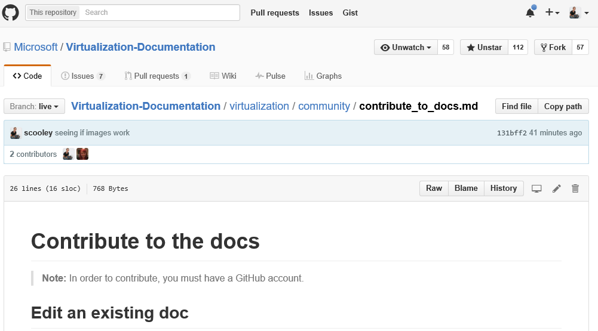
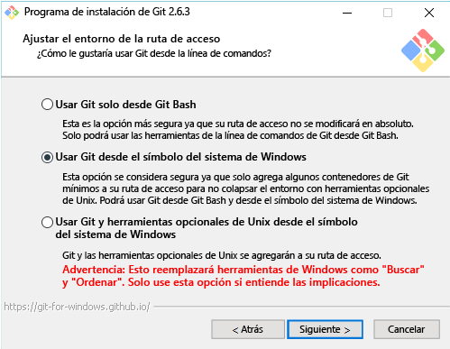

# Contribuir a los documentos

> **Nota**: Para contribuir, debe tener una cuenta de [GitHub](https://www.github.com).

## Editar un documento existente

1. Busque al documento que quiere editar.  

2. Seleccione **Contribute to this topic** (Contribuir a este tema).  
  
  
  Esto le redirigirá automáticamente al archivo de marcado de GitHub asociado a este archivo.
  
  Asegúrese de que inició sesión en GitHub.  Si no es así, inicie sesión en GitHub o cree una cuenta de GitHub.
  
  
  
3. Seleccione el icono de edición para editar con el editor del explorador.
  
  

4. Realice los cambios en línea.
  
  Acciones posibles:
  1. Editar archivo
  2. Vista previa de cambios
  3. Cambiar nombre del archivo (es muy poco probable que quiera hacerlo)
  
  
  
5. Proponer los cambios como una solicitud de incorporación de cambios
  
  

6. Revisar los cambios
  
  **Qué buscamos en una solicitud de incorporación de cambios**  
  * El cambio es correcto, representa de manera precisa la tecnología
  * La ortografía y la gramática son correctos
  * Ubicación lógica en la documentación
    
  

7. Crear una [solicitud de incorporación de cambios](contribute-to-docs.md#pull-requests)  

## Solicitudes de incorporación de cambios

La mayoría de los cambios se confirmarán a través de una solicitud de incorporación de cambios.  Una solicitud de incorporación de cambios es una manera de revisar un conjunto de cambios con varios revisores que cambian y comentan el contenido actual.


## Bifurcar el repositorio y editar localmente

Para el trabajo con documentos a largo plazo, clone el repositorio localmente y trabaje en su equipo.

En la guía siguiente se muestra cómo emular mi configuración (Sarah Cooley).  Hay muchas configuraciones alternativas que también funcionan bien.

> **Nota**: Todas estas herramientas de documentos también funcionan bien en Linux y OSX.  Si quiere obtener otras guías, solicítelas.

El proceso se divide en tres secciones:
* [Configuración de Git](contribute-to-docs.md#set-up-git)
  * Instalación de Git
  * Configuración inicial
  * Bifurcación del repositorio de documentación
  * Clonación de la copia en el equipo local
* [Administración de credenciales iniciales](contribute-to-docs.md#validate-and-stash-credentials)
  * Información sobre el guardado provisional de credenciales y la aplicación auxiliar de credenciales.
* [Configuración del entorno de documentación](contribute-to-docs.md#set-up-markdown-editing-environment)
  * Instalación de VSCode
  * Tutorial de VSCode para Git con algunas características útiles
  * Realización de la primera confirmación

### Configuración de Git

1. Instale Git (en Windows) desde [aquí](https://git-for-windows.github.io/).

  Solo deberá cambiar un valor de la instalación:

  **Adjusting your PATH environment** (Ajustar el entorno PATH) Use Git desde el símbolo del sistema de Windows

  

  Esto le permite usar comandos de Git en la consola de PowerShell o en cualquier consola de Windows.

2. Configurar la identidad de Git.

  Abra una ventana de PowerShell y ejecute lo siguiente:

  ``` PowerShell
  git config --global user.name "User Name"
  git config --global user.email username@microsoft.com
  ```

  Git usa estos valores para etiquetar las confirmaciones.

  > Si recibe el siguiente error, probablemente Git no esté instalado correctamente o deba reiniciar PowerShell.
    ``` PowerShell
    git : The term 'git' is not recognized as the name of a cmdlet, function, script file, or operable program. Check the spelling of the name, or if a path was included, verify that the path is correct and try again.
    ```

3. Configure el entorno de Git.

   Configure una aplicación auxiliar de credenciales para que solo tenga que escribir el nombre de usuario y la contraseña una vez (al menos en este equipo).
   Yo uso esta [aplicación auxiliar de credenciales de Windows](https://github.com/Microsoft/Git-Credential-Manager-for-Windows#download-and-install).

   Una vez que esté instalada, ejecute lo siguiente para habilitar la aplicación auxiliar de credenciales y establecer el comportamiento de inserción:
   ```
   git config --global credential.helper manager
   git config --global push.default simple
   ```

   La primera vez que se tenga que autenticar en GitHub se le solicitará el nombre de usuario y el código de autenticación en dos fases si está habilitado.
   Ejemplo:
   ```
   C:\Users\plang\Source\Repos\Virtualization-Documentation [master]> git pull
   Please enter your GitHub credentials for https://github.com/
   username: plang@microsoft.com
   password:
   authcode (app): 562689
   ```
   Esto configurará automáticamente un [token de acceso personal](https://github.com/settings/tokens) con los permisos adecuados en GitHub y lo almacenará de forma segura en el equipo local. No se le volverá a solicitar en el futuro.

4. Bifurque el repositorio.

5. Clone el repositorio.

  Git Clone hace una copia local del repositorio de Git con los enlaces adecuados para sincronizarse con otros clones del mismo repositorio.

  De forma predeterminada, el clon creará una carpeta con el mismo nombre que el repositorio en el directorio actual.  En mi caso, guardo todos los repositorios de Git en mi directorio de usuarios.  Obtenga más información sobre Git Clone [aquí](http://git-scm.com/docs/git-clone).

  ``` PowerShell
  cd ~
  git clone https://github.com/Microsoft/Virtualization-Documentation.git
  ```

  Si tiene éxito, ahora tiene una carpeta `Virtualization-Documentation`.

  ``` PowerShell
  cd Virtualization-Documentation
  ```

5. [Opcional] Configure Posh-Git.

  Posh-Git es un módulo de PowerShell creado por la comunidad que facilita el uso de Git en PowerShell.  Agrega tabulación para Git en PowerShell y también puede hacer que el símbolo del sistema muestre información útil sobre el estado de la bifurcación y los archivos.  Obtenga más información al respecto [aquí](https://github.com/dahlbyk/posh-git).  Puede instalar Posh-Git ejecutando lo siguiente en una consola de administrador de PowerShell.

  ``` PowerShell
  Install-Module -Name posh-git
  ```

  Para que Posh-Git funcione automáticamente cada vez que inicie PowerShell, agregue el código siguiente a su perfil de PowerShell (por ejemplo, `%UserProfile%\My Documents\WindowsPowerShell\profile.ps1 `).

  ``` PowerShell
  Import-Module posh-git

  function global:prompt {
    $realLASTEXITCODE = $LASTEXITCODE

    Write-Host($pwd.ProviderPath) -nonewline

    Write-VcsStatus

    $global:LASTEXITCODE = $realLASTEXITCODE
    return "> "
  }
  ```

### Validación y guardado provisional de las credenciales

  Para validar que el repositorio se ha configurado correctamente, intente extraer contenido nuevo.

  ``` PowerShell
  git pull
  ```


### Configuración del entorno de edición de Markdown

1. Descargue VSCode.

6. Realice una confirmación de prueba.  Si el guardado provisional de las credenciales se ha realizado correctamente, todo debería funcionar a la perfección.


<!--HONumber=Jan17_HO2-->


