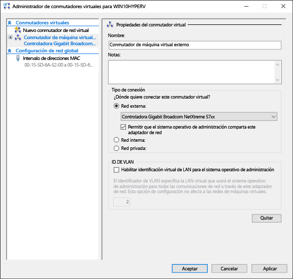
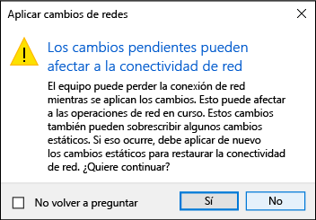

# <a name="create-a-virtual-network"></a>Crear una red virtual

Las máquinas virtuales necesitarán una red virtual para compartir una red con el equipo.  Crear una red virtual es opcional; si tu máquina virtual no necesita estar conectada a Internet o a una red, puedes pasar al siguiente paso de [crear una máquina virtual de Windows](create-virtual-machine.md).


## <a name="connect-virtual-machines-to-the-internet"></a>Conectar máquinas virtuales a Internet

Hyper-V tiene tres tipos de conmutadores virtuales: externos, internos y privados. Crear un conmutador externo para compartir la red de tu equipo con las máquinas virtuales que se ejecutan en ella.

Este ejercicio te guiará en el proceso de la creación de un conmutador virtual externo. Una vez completado, el host de Hyper-V tendrá un conmutador virtual que podrá conectar máquinas virtuales a Internet a través de la conexión de red del equipo. 

### <a name="create-a-virtual-switch-with-hyper-v-manager"></a>Crear un conmutador virtual con el administrador Hyper-V

1. Abre el Administrador Hyper-V.  Una forma rápida de hacerlo es presionando el botón Windows y escribiendo a continuación "administrador Hyper-V".  
Si la búsqueda no encuentra el administrador Hyper-V, significa que ni Hyper-V ni las herramientas de administración de Hyper-V están habilitadas.  Consulta las instrucciones para [habilitar Hyper-V](enable-hyper-v.md).

2. Selecciona el servidor en el panel izquierdo o haz clic en "Conectar al servidor..." en el panel derecho.

3. En el Administrador Hyper-V, selecciona **Administrador de conmutadores virtuales...** desde el menú "Acciones" situado en la parte derecha. 

4. En la sección "Conmutadores virtuales", selecciona **Nuevo conmutador de red virtual**.

5. En "¿Qué tipo de conmutador virtual deseas crear?", selecciona **Externo**.

6. Seleccione el botón **Crear conmutador virtual**.

7. En "Propiedades del conmutador virtual", asigne un nombre al nuevo conmutador, por ejemplo **External VM Switch** (Conmutador externo de máquina virtual).

8. En "Tipo de conexión", asegúrese de que se haya seleccionado **Red externa**.

9. Seleccione la tarjeta de red física que se emparejará con el nuevo conmutador virtual. Esta es la tarjeta de red conectada físicamente a la red.  

    

10. Seleccione **Aplicar** para crear el conmutador virtual. En este punto probablemente verá el siguiente mensaje. Haga clic en **Sí** para continuar.

      

11. Seleccione **Aceptar** para cerrar la ventana del administrador de conmutadores virtuales.


### <a name="create-a-virtual-switch-with-powershell"></a>Crear un conmutador virtual con PowerShell

Los pasos siguientes se pueden seguir para crear un conmutador virtual con una conexión externa mediante PowerShell. 

1. Use **Get-NetAdapter** para devolver una lista de adaptadores de red conectados al sistema de Windows 10.

    ```powershell
    PS C:\> Get-NetAdapter

    Name                      InterfaceDescription                    ifIndex Status       MacAddress             LinkSpeed
    ----                      --------------------                    ------- ------       ----------             ---------
    Ethernet 2                Broadcom NetXtreme 57xx Gigabit Cont...       5 Up           BC-30-5B-A8-C1-7F         1 Gbps
    Ethernet                  Intel(R) PRO/100 M Desktop Adapter            3 Up           00-0E-0C-A8-DC-31        10 Mbps  
    ```

2. Seleccione el adaptador de red que se usará con el conmutador de Hyper-V y coloque una instancia en una variable denominada **$net**.

    ```
    $net = Get-NetAdapter -Name 'Ethernet'
    ```

3. Ejecute el comando siguiente para crear el nuevo conmutador virtual de Hyper-V.

    ```
    New-VMSwitch -Name "External VM Switch" -AllowManagementOS $True -NetAdapterName $net.Name
    ```

## <a name="virtual-networking-on-a-laptop"></a>Redes virtuales en un portátil

### <a name="nat-networking"></a>Redes NAT
La traducción de direcciones de red (NAT) permite el acceso de una máquina virtual a la red del equipo con la dirección IP y un puerto del equipo host a través de un conmutador virtual de Hyper-V interno.

Esto tiene unas cuantas propiedades útiles:
1. La NAT conserva las direcciones IP asignando una dirección IP externa y un puerto a un grupo más grande de direcciones IP internas. 
2. NAT permite que varias máquinas virtuales hospeden aplicaciones que necesitan puertos de comunicación idénticos (internos) asignándolos a puertos externos únicos.
3. NAT usa un conmutador interno: al crear un conmutador interno, no tienes que usar la conexión de red y tiende a interferir menos con la red del equipo.

Para configurar una red NAT y conectarla a una máquina virtual, sigue el [Guía del usuario de redes NAT](../user-guide/setup-nat-network.md).

### <a name="the-two-switch-approach"></a>El enfoque de dos conmutadores
Si estás ejecutando Hyper-V de Windows 10 en un equipo portátil y cambias con frecuencia de una red inalámbrica a una red con cable, deberías considerar la idea de crear un conmutador virtual para las tarjetas de red Ethernet e inalámbricas. Con esta configuración, puede cambiar las máquinas virtuales entre estos conmutadores según cómo esté conectado a la red el portátil. Las máquinas virtuales no cambiarán automáticamente entre conexión con cable e inalámbrica.


## <a name="next-step---create-a-virtual-machine"></a>Siguiente paso: crear una máquina virtual
[Crear una máquina virtual Windows](create-virtual-machine.md)
