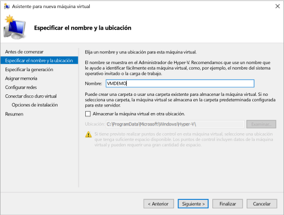
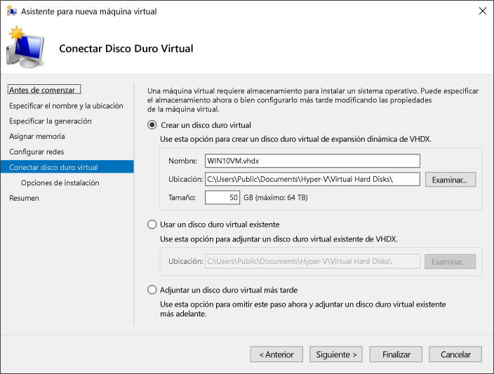

# Implementar una máquina virtual de Windows en Hyper-V en Windows 10

Puede crear una máquina virtual e implementar un sistema operativo en ella de muchas maneras diferentes, por ejemplo, mediante Servicios de implementación de Windows, adjuntando una unidad de disco duro virtual preparada, o manualmente, mediante los medios de instalación. Este artículo le guía por el proceso de creación de una máquina virtual e implementación de un sistema operativo en la máquina virtual con los medios de instalación del sistema operativo.

Antes de comenzar este ejercicio, necesitará un archivo .iso del sistema operativo que quiera implementar. Si es necesario, obtenga una copia de evaluación de Windows 8.1 o Windows 10 de [TechNet Evaluation Center](http://www.microsoft.com/en-us/evalcenter/).

## Crear una máquina virtual con el Administrador de Hyper-V
En estos pasos se describe cómo se crea manualmente una máquina virtual y se implementa un sistema operativo en esta máquina virtual.

1. En el Administrador de Hyper-V, haga clic en **Acción** > **Nueva** > ** Máquina Virtual** para que se abra el Asistente para nueva máquina virtual.

2. Revise el contenido de "Antes de empezar" y haga clic en **Siguiente**. 

3. Asigne un nombre a la máquina virtual.
  > **Nota**: Este es el nombre que usa Hyper-V para la máquina virtual, no el nombre de equipo asignado al sistema operativo invitado que se implementará en la máquina virtual.

4. Seleccione la ubicación en la que se almacenarán los archivos de la máquina virtual, por ejemplo **c:\virtualmachine**. También puede aceptar la ubicación predeterminada. Haga clic en **Siguiente** cuando termine.
    
  

5. Seleccione una generación para el equipo y haga clic en **Siguiente**.  

  Las máquinas virtuales de generación 2 se introdujeron con Windows Server 2012 R2 y ofrecen un modelo de hardware virtual simplificado y algunas funciones adicionales. Solo se puede instalar un sistema operativo de 64 bits en una máquina virtual de generación 2. Para más información sobre las máquinas virtuales de generación 2, consulte [Información general acerca de las máquinas virtuales de generación 2](https://technet.microsoft.com/en-us/library/dn282285.aspx).
  
  > Si la nueva máquina virtual está configurada como generación 2 y va a ejecutar una distribución de Linux, tendrá que deshabilitar el arranque seguro. Para más información, consulte [Arranque seguro](https://technet.microsoft.com/en-us/library/dn486875.aspx).

6. Seleccione **2048** MB como valor de **Memoria de inicio** y deje seleccionada la opción **Usar la memoria dinámica**. Haga clic en el botón **Siguiente**.  

  La memoria se comparte entre un host de Hyper-V y la máquina virtual que se ejecuta en el host. El número de máquinas virtuales que se puede ejecutar en un único host depende en parte de la memoria disponible. Una máquina virtual también se puede configurar para utilizar memoria dinámica. Cuando está habilitada, la memoria dinámica reclama la memoria no utilizada de la máquina virtual en ejecución. Esto permite que varias máquinas virtuales se ejecuten en el host. Para más información sobre la memoria dinámica, consulte [Introducción a la memoria dinámica de Hyper-V](https://technet.microsoft.com/en-us/library/hh831766.aspx).

7. En el Asistente para configurar funciones de red, seleccione un conmutador virtual para la máquina virtual y haga clic en **Siguiente**. Para más información, consulte [Crear un conmutador virtual](connect-to-network.md).

8. Asigne un nombre a la unidad de disco duro virtual, seleccione una ubicación o mantenga el valor predeterminado y, por último, especifique un tamaño. Haga clic en **Siguiente** cuando esté listo.

  Una unidad de disco duro virtual ofrece almacenamiento para una máquina virtual, de forma similar a una unidad de disco duro físico. Una unidad de disco duro virtual es necesaria para que pueda instalar un sistema operativo en la máquina virtual.
  
    

9. En el Asistente de opciones de instalación, seleccione **Instalar un sistema operativo desde un archivo de imagen de arranque** y luego seleccione un archivo .iso del sistema operativo. Haga clic en **Siguiente** cuando se haya completado.

  Al crear una máquina virtual, puede configurar algunas opciones de instalación del sistema operativo. Las tres opciones disponibles son:

  - **Instalar un sistema operativo más adelante**: esta opción no realiza ninguna modificación adicional en la máquina virtual.

  - **Instalar un sistema operativo desde un archivo de imagen de arranque**: esto es similar a insertar un CD en la unidad de CD-ROM física de un equipo. Para configurar esta opción, seleccione una imagen .iso. Esta imagen se montará en la unidad de CD-ROM virtual de la máquina virtual. El orden de arranque de la máquina virtual cambia para arrancar primero desde la unidad de CD-ROM.

  - **Instalar un sistema operativo desde un servidor de instalación en red**: esta opción no está disponible a menos que haya conectado la máquina virtual a un conmutador de red. En esta configuración, la máquina virtual intenta arrancar desde la red.
  
10. Revise los detalles de la máquina virtual y haga clic en **Finalizar** para completar la creación de la máquina virtual.

## Crear una máquina virtual con PowerShell

1. Abra PowerShell ISE como administrador.

2. Ejecute el siguiente script.

  ```powershell
  # Set VM Name, Switch Name, and Installation Media Path.
  $VMName = 'TESTVM'
  $Switch = 'External VM Switch'
  $InstallMedia = 'C:\Users\Administrator\Desktop\en_windows_10_enterprise_x64_dvd_6851151.iso'
  
  # Create New Virtual Machine
  New-VM -Name $VMName -MemoryStartupBytes 2147483648 -Generation 2 -NewVHDPath "D:\Virtual Machines\$VMName\$VMName.vhdx" -NewVHDSizeBytes 53687091200 -Path "D:\Virtual Machines\$VMName" -SwitchName $Switch
  
  # Add DVD Drive to Virtual Machine
  Add-VMScsiController -VMName $VMName
  Add-VMDvdDrive -VMName $VMName -ControllerNumber 1 -ControllerLocation 0 -Path $InstallMedia
  
  # Mount Installation Media
  $DVDDrive = Get-VMDvdDrive -VMName $VMName
  
  # Configure Virtual Machine to Boot from DVD
  Set-VMFirmware -VMName $VMName -FirstBootDevice $DVDDrive
  ```
  
## Completar la implementación del sistema operativo

Para terminar de crear la máquina virtual, debe iniciar la máquina virtual y completar la instalación del sistema operativo.

1. En el administrador de Hyper-V, haga doble clic en la máquina virtual. Esto inicia la herramienta VMConnect.

2. En VMConnect, haga clic en el botón verde de Inicio. Esto es similar a presionar el botón de encendido de un equipo físico. Es posible que se le indique "Presione cualquier tecla para arrancar desde el CD o DVD". Hágalo.
  > **Nota**: Puede que necesite hacer clic en la ventana de VMConnect para garantizar que se envían las pulsaciones de tecla a la máquina virtual.

3. La máquina virtual se inicia en el programa de instalación y puede realizar la instalación como lo haría en un equipo físico.

   

> **Nota**: A menos que esté ejecutando una versión con licencia por volumen de Windows, necesitará una licencia independiente para la versión de Windows que se ejecuta en una máquina virtual. El sistema operativo de la máquina virtual es independiente del sistema operativo del host.

## Paso siguiente: trabajar con PowerShell e Hyper-V
[Hyper-V y Windows PowerShell](try-hyper-v-powershell.md)


<!--HONumber=Jan17_HO2-->


