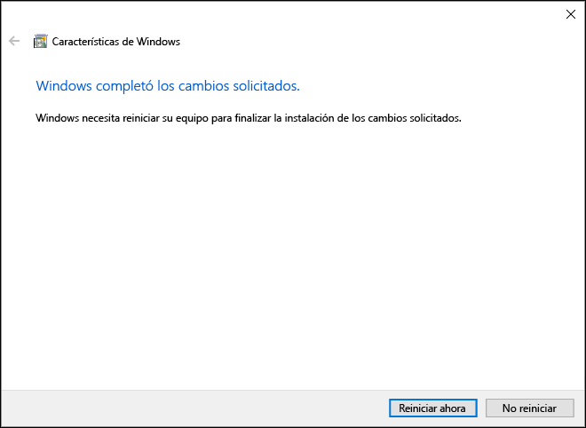

# <a name="install-hyper-v-on-windows-10"></a>Instalar Hyper-V en Windows 10

Habilitar Hyper-V para crear máquinas virtuales en Windows 10.  
Hyper-V puede habilitarse de muchas maneras, incluido el uso del panel de control de Windows 10, PowerShell (mi favorita) o la herramienta de Administración y mantenimiento de imágenes de implementación (DISM). Este documento explica paso a paso cada una de las opciones.

> **Nota:** Hyper-V está integrado en Windows como una característica opcional: no hay ninguna descarga de Hyper-V ni un componente instalable. 

## <a name="check-requirements"></a>Comprobación de los requisitos

* Windows 10 Enterprise, Professional, o Education
* Procesador de 64 bits con traducción de direcciones de segundo nivel (SLAT).
* Compatibilidad de CPU con la extensión del modo monitor de la máquina virtual (VT-c en CPU de Intel).
* Mínimo de 4 GB de memoria.

El rol de Hyper-V **no** se puede instalar en Windows 10 Home.  
Puedes actualizar Windows 10 Home Edition a Windows 10 Professional abriendo **Configuración** > **Actualización y seguridad** > **Activación**.

Para más información y solución de problemas, consulta [Requisitos de sistema de Hyper-V en Windows 10](../reference/hyper-v-requirements.md).


## <a name="install-hyper-v"></a>Instalar Hyper-V 
Hyper-V está integrado en Windows como una característica opcional: no hay ninguna descarga de Hyper-V ni un componente instalable.  Hay varias maneras de habilitar el rol de Hyper-V integrado.

### <a name="enable-hyper-v-using-powershell"></a>Habilitar Hyper-V usando PowerShell

1. Abre una consola de PowerShell como administrador.

2. Ejecuta el siguiente comando:
  ```powershell
  Enable-WindowsOptionalFeature -Online -FeatureName:Microsoft-Hyper-V -All
  ```  

  Si no fue posible encontrar el comando, asegúrate de que estás ejecutando PowerShell como administrador.  

Cuando la instalación se haya completado, deberás reiniciar el equipo.  

### <a name="enable-hyper-v-with-cmd-and-dism"></a>Habilitar Hyper-V con CMD y DISM

La herramienta Administración y mantenimiento de imágenes de implementación (DISM) ayuda a configurar Windows y las imágenes de Windows.  Entre sus muchas aplicaciones, DISM puede habilitar características de Windows mientras se ejecuta el sistema operativo.  

Para habilitar el rol de Hyper-V mediante DISM:
1. Abra una sesión de PowerShell o CMD como administrador.

2. Escribe el comando siguiente:  
  ```powershell
  DISM /Online /Enable-Feature /All /FeatureName:Microsoft-Hyper-V
  ```  
  

Para más información sobre DISM, consulta [Referencia técnica de DISM](https://technet.microsoft.com/en-us/library/hh824821.aspx).

### <a name="manually-enable-the-hyper-v-role"></a>Habilitar manualmente el rol de Hyper-V

1. Haga clic con el botón derecho en el botón de Windows y seleccione "Programas y características".

2. Seleccione **Activar o desactivar las características de Windows**.

3. Seleccione **Hyper-V** y haga clic en **Aceptar**.  


Cuando la instalación se complete, se te pedirá confirmación para reiniciar el equipo.




## <a name="make-virtual-machines"></a>Crear máquinas virtuales
[Crea tu primera máquina virtual](quick-create-virtual-machine.md)
