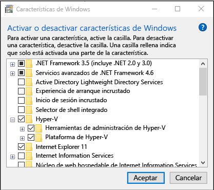

# <a name="install-hyper-v-on-windows-10"></a>Instalar Hyper-V en Windows 10

Habilitar Hyper-V para crear máquinas virtuales en Windows 10.  
Hyper-V puede habilitarse de muchas maneras, incluido el uso del panel de control de Windows 10, PowerShell (mi favorita) o la herramienta de Administración y mantenimiento de imágenes de implementación (DISM). Este documento explica paso a paso cada una de las opciones.

> **Nota:**  Hyper-V está integrado en Windows como función opcional: no existen descargas de Hyper-V.

## <a name="check-requirements"></a>Comprobación de los requisitos

* Windows 10 Enterprise, Pro o Education
* Procesador de 64 bits con traducción de direcciones de segundo nivel (SLAT).
* Compatibilidad de CPU para la extensión del modo Monitor de máquina virtual (VT-c en CPU de Intel).
* Mínimo de 4 GB de memoria.

El rol de Hyper-V **no** se puede instalar en Windows 10 Home.

Actualizar Windows 10 Home edition a Windows 10 Pro abriendo **configuración** > **actualización y seguridad** > **activación**.

Para más información y solución de problemas, consulta [Requisitos de sistema de Hyper-V en Windows 10](../reference/hyper-v-requirements.md).

## <a name="enable-hyper-v-using-powershell"></a>Habilitar Hyper-V usando PowerShell

1. Abre una consola de PowerShell como administrador.

2. Ejecuta el siguiente comando:

  ```powershell
  Enable-WindowsOptionalFeature -Online -FeatureName Microsoft-Hyper-V -All
  ```

  Si no fue posible encontrar el comando, asegúrate de que estás ejecutando PowerShell como administrador.

Cuando la instalación haya finalizado, reinicia.

## <a name="enable-hyper-v-with-cmd-and-dism"></a>Habilitar Hyper-V con CMD y DISM

La herramienta Administración y mantenimiento de imágenes de implementación (DISM) ayuda a configurar Windows y las imágenes de Windows.  Entre sus muchas aplicaciones, DISM puede habilitar características de Windows mientras se ejecuta el sistema operativo.

Para habilitar el rol de Hyper-V mediante DISM:

1. Abra una sesión de PowerShell o CMD como administrador.

1. Escribe el comando siguiente:

  ```powershell
  DISM /Online /Enable-Feature /All /FeatureName:Microsoft-Hyper-V
  ```

  

Para más información sobre DISM, consulta [Referencia técnica de DISM](https://technet.microsoft.com/en-us/library/hh824821.aspx).

## <a name="enable-the-hyper-v-role-through-settings"></a>Habilitar el rol de Hyper-V en Configuración

1. Haz clic con el botón derecho en el botón Windows y selecciona ‘Aplicaciones y funciones’.

2. Selecciona los **programas y características** de la derecha en la configuración relacionada. 

3. Selecciona **Activar o desactivar las características de Windows**.

4. Selecciona **Hyper-V** y haz clic en **Aceptar**.



Cuando la instalación se complete, se te pedirá confirmación para reiniciar el equipo.

## <a name="make-virtual-machines"></a>Crear máquinas virtuales

[Crea tu primera máquina virtual](quick-create-virtual-machine.md)
