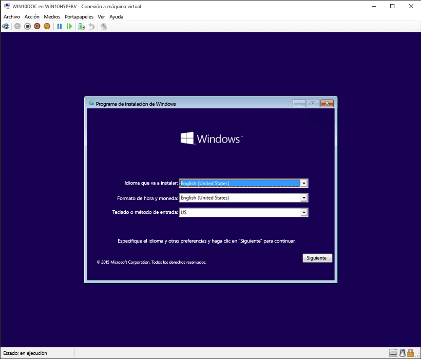

# Crear una máquina virtual con Hyper-V

Crea una máquina virtual e instala su sistema operativo.  

Necesitarás un archivo .iso para el sistema operativo que quieras ejecutar. Si no tienes una disponible, hazte con una copia de evaluación de Windows en el [TechNet Evaluation Center](http://www.microsoft.com/en-us/evalcenter/).

> Windows 10 Creators Update introdujo una nueva herramienta, **Creación rápida**, para simplificar la creación de nuevas máquinas virtuales.  
  Si no ejecutas Windows 10 Creators Update o una versión posterior, sigue estas instrucciones usando en su lugar el Asistente para crear nueva máquina virtual:  
  [Crear una máquina virtual nueva](create-virtual-machine.md)  
  [Crear una red virtual](connect-to-network.md)

Empecemos.

1. **Abre el administrador de Hyper-V.**  
  Presiona la tecla Windows y escribe "Administrador de Hyper-V" para buscar las aplicaciones del administrador de Hyper-V o desplázate por las aplicaciones en el menú Inicio hasta que encuentres el administrador de Hyper-V.

2. **Abre Creación rápida**  
  En el administrador de Hyper-V, busca **Creación rápida** en el menú **Acciones** del lado derecho.

3. **Personaliza la máquina virtual**
  * (opcional) Asigna un nombre a la máquina virtual.  
    Este es el nombre que Hyper-V usa para la máquina virtual, no el nombre de equipo asignado al sistema operativo invitado que se implementará en la máquina virtual.
  * Selecciona el medio de instalación para la máquina virtual. Puedes instalar desde un archivo .iso o .vhdx.  
    Si vas a instalar Windows en la máquina virtual, puedes habilitar el arranque seguro de Windows. Si no, déjalo sin seleccionar.
  * Configurar la red.  
    Si tienes un conmutador virtual existente, puedes seleccionarlo en la lista desplegable de redes. Si no tienes ningún conmutador existente, verás un botón para configurar una red automática, lo que configurará automáticamente un conmutador externo.

4. **Conéctate a la máquina virtual**  
  Si seleccionas **Conectar**, se lanzará la conexión con la máquina virtual y se iniciará la máquina virtual.     
  No te preocupes por editar la configuración. Puedes volver y cambiarla en cualquier momento.  
  
    Es posible que se te indique "Presione cualquier tecla para arrancar desde CD o DVD". Hágalo.  En lo que respecta a la máquina virtual, estás instalando desde un CD.

Enhorabuena, ya tienes una nueva máquina virtual.  Ahora estás listo para instalar el sistema operativo.  

La máquina virtual debe ser similar a la siguiente:  
 

> **Nota**: A menos que esté ejecutando una versión con licencia por volumen de Windows, necesitarás una licencia independiente para la versión de Windows que se ejecute en una máquina virtual. El sistema operativo de la máquina virtual es independiente del sistema operativo del host.
