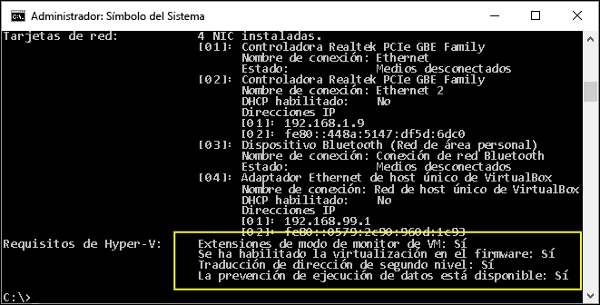

# <a name="windows-10-hyper-v-system-requirements"></a>Requisitos de sistema de Hyper-V en Windows 10

Hyper-V está disponible en la versión de 64 bits de las ediciones Professional, Enterprise y Education de Windows 8, y en las versiones superiores.  Hyper-V requiere traducción de direcciones de segundo nivel (SLAT), que está presente en la generación actual de procesadores de 64 bits de Intel y AMD.

Puede ejecutar tres o cuatro máquinas virtuales básicas en un host que tenga 4 GB de RAM, aunque se necesitarán más recursos si se desea ejecutar más. En el otro extremo del espectro, también se pueden crear máquinas virtuales grandes con 32 procesadores y 512GB de RAM, en función del hardware físico.

## <a name="operating-system-requirements"></a>Requisitos del sistema operativo

El rol de Hyper-V puede habilitarse en estas versiones de Windows 10:

- Windows 10 Enterprise
- Windows 10 Professional
- Windows 10 Education

El rol de Hyper-V **no** se puede instalar en:

- Windows 10 Home
- Windows 10 Mobile
- Windows 10 Mobile Enterprise

>10 de Windows Home edition puede actualizarse a Windows 10 Professional. Para hacerlo, abra **Configuración** > **Actualización y seguridad** > ** Activación**. Aquí puede visitar la tienda y comprar una actualización.

## <a name="hardware-requirements"></a>Requisitos de hardware

Aunque este documento no ofrece una lista completa del hardware compatible con Hyper-V, son necesarios los siguientes elementos:
    
- Procesador de 64 bits con traducción de direcciones de segundo nivel (SLAT).
- Compatibilidad de CPU con la extensión del modo monitor de la máquina virtual (VT-c en CPU de Intel).
- Mínimo de 4 GB de memoria. Como las máquinas virtuales comparten memoria con el host de Hyper-V, debe proporcionar memoria suficiente para administrar la carga de trabajo virtual prevista.

Es preciso habilitar los siguientes elementos en el BIOS del sistema:
- Tecnología de virtualización (puede tener un nombre diferente según el fabricante de la placa base).
- Prevención de ejecución de datos aplicada por hardware.

## <a name="verify-hardware-compatibility"></a>Comprobar la compatibilidad de hardware

Para comprobar la compatibilidad, abre PowerShell o un símbolo del sistema (cmd.exe) y escribe **systeminfo**. Si todos los requisitos que se enumeran de Hyper-V tienen un valor de **Sí**, el sistema puede ejecutar el rol de Hyper-V. Si algún elemento devuelve **No**, comprueba los requisitos que se muestran en el documento y realiza ajustes cuando sea posible.



Si ejecutas **systeminfo** en un host de Hyper-V existente, la sección de requisitos de Hyper-V se indica:

```
Hyper-V Requirements: A hypervisor has been detected. Features required for Hyper-V are not be displayed.
```