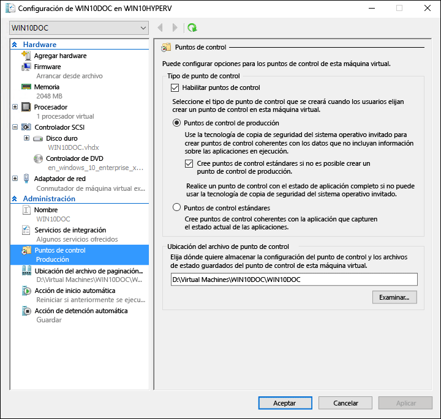
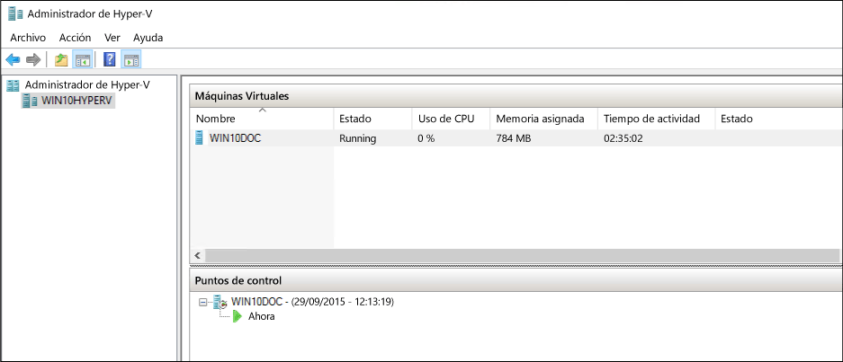
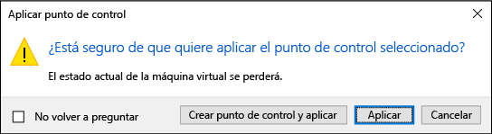
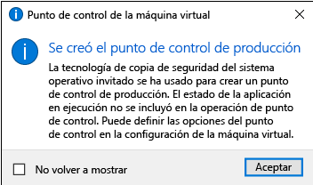

# Uso de puntos de control para revertir máquinas virtuales a un estado anterior

Una de las grandes ventajas de la virtualización es la capacidad de guardar fácilmente el estado de una máquina virtual. En Hyper-V, esto se consigue mediante el uso de puntos de control de la máquina virtual. Puede crear un punto de control de la máquina virtual antes de realizar cambios de configuración de software, aplicar una actualización de software o instalar software nuevo. Si un cambio del sistema produjera un error, la máquina virtual podría revertirse al estado en que estaba cuando se capturó el punto de control.

Hyper-V de Windows 10 incluye dos tipos de puntos de control:

* **Puntos de control estándar**: toman una instantánea de la máquina virtual y el estado de memoria de la máquina virtual en el momento en que se inicia el punto de control. Una instantánea no es una copia de seguridad completa y puede causar problemas de coherencia de datos con los sistemas que replican datos entre distintos nodos, como Active Directory.  Solo Hyper-V ofrece puntos de control estándar (anteriormente denominados instantáneas) antes de Windows 10.

* **Puntos de control de producción**: usan el Servicio de instantáneas de volumen o la congelación del sistema de archivos en una máquina virtual Linux para crear un respaldo coherente de datos de la máquina virtual. No se crea ninguna instantánea del estado de memoria de la máquina virtual.

Los puntos de control de producción se seleccionan de forma predeterminada, pero puede cambiarlo con el Administrador de Hyper-V o PowerShell.

> **Nota:** El módulo de PowerShell de Hyper-V tiene varios alias para que el punto de control y la instantánea se puedan usar indistintamente.  
  En este documento se utiliza el punto de control, pero tenga en cuenta que puede ver comandos similares que usen el término instantánea.

## Cambiar el tipo de punto de control

**Uso del Administrador de Hyper-V**

1. Abre el Administrador de Hyper-V.
2. Haga clic con el botón derecho en una máquina virtual y seleccione **Configuración**.
3. En Administración, seleccione **Puntos de control**.
4. Seleccione el tipo de punto de control que quiere.

<br />


**Con PowerShell**

Los siguientes comandos se pueden ejecutar para cambiar el punto de control con PowerShell. 

Configurar como punto de control estándar:
```powershell
Set-VM -Name <vmname> -CheckpointType Standard
```

Configurar como punto de control de producción, si se produce un error en un punto de control de producción, se crea un punto de control estándar:
```powershell
Set-VM -Name <vmname> -CheckpointType Production
```

Configurar como punto de control de producción, si se produce un error en un punto de control de producción, no se crea un punto de control estándar. 
```powershell
Set-VM -Name <vmname> -CheckpointType ProductionOnly
```

## Creación de puntos de control

Crea un punto de control del tipo configurado para la máquina virtual. Consulte la sección [Configuración del tipo de punto de control](checkpoints.md#changing-the-checkpoint-type) anterior de este documento para obtener instrucciones sobre cómo cambiar este tipo.

**Uso del Administrador de Hyper-V**

Para crear un punto de control:  
1. En Administrador de Hyper-V, seleccione la máquina virtual.
2. Haga clic con el botón derecho en el nombre de la máquina virtual y luego haga clic en **Punto de control**.
3. Cuando se complete el proceso, el punto de control aparecerá en **Puntos de control** en el **Administrador de Hyper-V**.

**Con PowerShell**

Cree un punto de control con el comando **CheckPoint-VM**.  

```powershell
Checkpoint-VM -Name <VMName>
```

Cuando se complete el proceso del punto de control, vea una lista de los puntos de control de una máquina virtual mediante el comando **Get-VMCheckpoint**.

```powershell
Get-VMCheckpoint -VMName <VMName>
```

## Aplicación de puntos de control

Si quiere revertir la máquina virtual a un momento concreto anterior, puede aplicar un punto de control existente.

**Uso del Administrador de Hyper-V**

1.  En **Administrador de Hyper-V**, en **Máquinas virtuales**, seleccione la máquina virtual.
2.  En la sección Puntos de control, haga clic con el botón derecho en el punto de control que quiere usar y haga clic en **Aplicar**.
3.  Aparece un cuadro de diálogo con las siguientes opciones:  
  * **Crear punto de control y aplicar**: crea un nuevo punto de control de la máquina virtual antes de aplicar el punto de control anterior. 
  * **Aplicar**: aplica solo el punto de control que eligió. No se puede deshacer esta acción.
  * **Cancelar**: cierra el cuadro de diálogo sin hacer nada.
  
  Seleccione cualquier opción Aplicar para crear el punto de control.

**Con PowerShell**

5. Para ver una lista de los puntos de control de una máquina virtual, use el comando **Get-VMCheckpoint**.

    ```powershell
    Get-VMCheckpoint -VMName <VMName>
    ```
6. Para aplicar el punto de control, use el comando **Restore-VMCheckpoint**.

    ```powershell
    Restore-VMCheckpoint -Name <checkpoint name> -VMName <VMName> -Confirm:$false
    ```

## Cambiar el nombre de los puntos de control

Muchos puntos de comprobación se crean en un momento concreto.  Darles un nombre identificable hace más fácil recordar los detalles sobre el estado del sistema cuando se creó el punto de control.

De forma predeterminada, el nombre de un punto de control es el nombre de la máquina virtual combinado con la fecha y hora en que se capturó el punto de control. Este es el formato estándar: 

```
virtual_machine_name (MM/DD/YYY -hh:mm:ss AM\PM)
```

Los nombres están limitados a 100 caracteres y el nombre no puede estar en blanco. 

**Uso del Administrador de Hyper-V**

1.  En **Administrador de Hyper-V**, seleccione la máquina virtual.
2.  Haga clic con el botón derecho en el punto de control y luego seleccione **Cambiar el nombre**.
3.  Escriba el nuevo nombre del punto de control. Debe tener menos de 100 caracteres y el campo no puede estar vacío.
4.  Haga clic en **ENTRAR** cuando haya terminado.

**Uso de PowerShell**

``` powershell
Rename-VMCheckpoint -VMName <virtual machine name> -Name <checkpoint name> -NewName <new checkpoint name>
```

## Eliminación de puntos de control

La eliminación de puntos de control puede ayudar a crear espacio en el host de Hyper-V.

Los puntos de control se almacenan como archivos .avhdx en la misma ubicación que los archivos .vhdx de la máquina virtual. Cuando se elimina un punto de control, Hyper-V combina los archivos .avhdx y .vhdx.  Una vez completada esta acción, se eliminará el archivo .avhdx del punto de comprobación del sistema de archivos. 

No debe eliminar los archivos .avhdx directamente.
 
**Uso del Administrador de Hyper-V**

Para eliminar correctamente un punto de control: 

1.  En **Administrador de Hyper-V**, seleccione la máquina virtual.
2.  En la sección **Puntos de control**, haga clic con el botón derecho en el punto de control que quiere eliminar y haga clic en Eliminar. También puede eliminar un punto de control y todos los puntos de control posteriores. Para ello, haga clic con el botón derecho en el punto de control más antiguo que quiera eliminar y después haga clic en ****Eliminar punto de control** Subárbol**.
3.  Es posible que se le pida confirmación para eliminar el punto de control. Confirme que se trata del punto de control correcto y luego haga clic en **Eliminar**. 
 
**Con PowerShell**
```powershell
Remove-VMCheckpoint -VMName <virtual machine name> -Name <checkpoint name>
```

## Exportación de puntos de control

La exportación empaqueta el punto de control como una máquina virtual para que se pueda mover a una nueva ubicación. Una vez importado, se restaura el punto de control como una máquina virtual.  Los puntos de control exportados pueden usarse como copias de seguridad.

**Con PowerShell**
``` powershell
Export-VMCheckpoint -VMName <virtual machine name> -Name <checkpoint name> -Path <path for export>
```

## Habilitar o deshabilitar puntos de control

1.  En **Administrador de Hyper-V**, haga clic con el botón derecho en el nombre de la máquina virtual y haga clic en **Configuración**.
2.  En la sección **Administración**, seleccione **Puntos de control**.
3.  Para permitir que se capturen puntos de control de esta máquina virtual, asegúrese de que la opción Habilitar puntos de control está seleccionada (se trata del comportamiento predeterminado).  
Para deshabilitar los puntos de control, anule la selección de la casilla **Habilitar puntos de control**.
4.  Haga clic en **Aplicar** para aplicar los cambios. Si ha terminado, haga clic en **Aceptar** para cerrar el cuadro de diálogo.

## Configurar la ubicación del punto de control

Si la máquina virtual no tiene puntos de control, puede cambiar dónde se almacenan los archivos de estado guardado y la configuración de los puntos de control.

1.  En **Administrador de Hyper-V**, haga clic con el botón derecho en el nombre de la máquina virtual y haga clic en **Configuración**.    
2.  En la sección **Administración**, seleccione **Puntos de control** o **Ubicación del archivo de puntos de control**.  
4.  En **Ubicación del archivo de puntos de control**, escriba la ruta de acceso a la carpeta donde quiere almacenar los archivos.  
5.  Haga clic en **Aplicar** para aplicar los cambios. Si ha terminado, haga clic en **Aceptar** para cerrar el cuadro de diálogo.

La ubicación predeterminada para almacenar los archivos de configuración de los puntos de control es: `%systemroot%\ProgramData\Microsoft\Windows\Hyper-V\Snapshots`.


<!-- This belongs in dev docs

This folder will contain the .VMRS file with the runtime and saved state data and a .VMCX configuration file, which uses the checkpoint GUID as the file name.
-->

## Demostración de punto de control

En este ejercicio se le guía a través de la creación y la aplicación de un punto de control estándar frente a un punto de control de comprobación.  Para este ejemplo, realizará un pequeño cambio en la máquina virtual y observará el comportamiento diferente. 

### Punto de control estándar

1. Inicie sesión en la máquina virtual y cree un archivo de texto en el escritorio.
2. Abra el archivo con el Bloc de notas y escriba el texto "Esto es un punto de control estándar.". **No guarde el archivo ni cierre el Bloc de notas**.  
3. Cambie el punto de control a estándar, consulte las instrucciones [aquí](checkpoints.md#changing-the-checkpoint-type).
4. Cree un punto de control nuevo.

<br />
 

**Aplicar el punto de control estándar con el Administrador de Hyper-V**

Ahora que existe un punto de control, realice una modificación en la máquina virtual y aplique el punto de control para revertir la máquina virtual al estado guardado. 

1. Cierre el archivo de texto si aún está abierto y elimínelo del escritorio de la máquina virtual.
2. Abra el Administrador de Hyper-V, haga clic con el botón derecho en el punto de control estándar y seleccione Aplicar.
3. Seleccione Aplicar en la ventana de notificación Aplicar el punto de control.

<br />
 

Cuando se haya aplicado el punto de control, tenga en cuenta que no solo está presente el archivo de texto, sino que el sistema está en el mismo estado en que se encontraba cuando se creó el punto de control. En este caso, el Bloc de notas está abierto y el archivo de texto está cargado.

### Punto de control de producción

Ahora examinemos los puntos de control de producción. Este proceso es casi idéntico a trabajar con un punto de control estándar, aunque tendrá resultados ligeramente diferentes. Antes de comenzar, asegúrese de que dispone de una máquina virtual y de que ha cambiado el tipo de punto de control a Puntos de control de producción.

**Modificar la máquina virtual y crear un punto de control de producción**

1. Inicie sesión en la máquina virtual y cree un nuevo archivo de texto. Si ha seguido estos ejercicios, puede utilizar el archivo de texto existente.
2. Escriba "Esto es un punto de control de producción." en el archivo de texto y guarde el archivo, pero **no cierre el Bloc de notas**.
3. Abra el Administrador de Hyper-V > haga clic con el botón derecho en la máquina virtual > seleccione **Punto de control**.
4. Haga clic en **Aceptar** en la ventana Punto de control de producción creado.

<br />
 
    
**Aplicar el punto de control de producción con el Administrador de Hyper-V**

Ahora que existe un punto de control, haga una modificación en el sistema y luego aplique el punto de control para revertir la máquina virtual al estado guardado. 

1. Cierre el archivo de texto si aún está abierto y elimínelo del escritorio de la máquina virtual.
2. Abra el Administrador de Hyper-V, haga clic con el botón derecho en el punto de control de producción y seleccione **Aplicar**.
3. Seleccione **Aplicar** en la ventana de notificación Aplicar el punto de control.

Cuando se haya aplicado el punto de control de producción, observe que la máquina virtual está en un estado desactivado.

1. Inicie la máquina virtual e inicie sesión.
2. Tenga en cuenta que se ha restaurado el archivo de texto. Pero, a diferencia del punto de control estándar, el Bloc de notas no está abierto.   


<!--HONumber=Nov16_HO1-->


