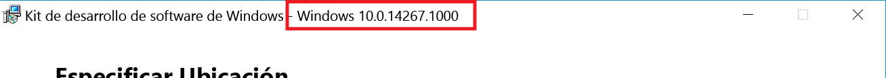

# Cree sus propios servicios de integración

A partir de Windows 10, cualquier usuario puede crear un servicio muy similar a los servicios de integración de Hyper-V con un nuevo canal de comunicación basado en sockets entre el host de Hyper-V y las máquinas virtuales que se ejecuten en él. Mediante el uso de estos sockets de Hyper-V, los servicios pueden ejecutarse independientemente de la pila de red, y todos los datos se mantienen en la misma memoria física.

Este documento le guía por la creación de una aplicación sencilla basada en sockets de Hyper-V y explica cómo comenzar a utilizarlos.

[PowerShell Direct](../user_guide/vmsession.md) es un ejemplo de una aplicación, en este caso un servicio incluido con Windows, que usa sockets de Hyper-V para comunicarse.

**Sistemas operativos de host admitidos**
* Compilación 14290 de Windows 10 y versiones posteriores
* Windows Server Technical Preview 4 y versiones posteriores
* Las versiones futuras (Server 2016 +)

**Sistemas operativos de invitado admitidos**
* Windows 10
* Windows Server Technical Preview 4 y versiones posteriores
* Las versiones futuras (Server 2016 +)
* Invitados de Linux con servicios de integración de Linux (consulte [Máquinas virtuales de FreeBSD y Linux compatibles con Hyper-V en Windows](https://technet.microsoft.com/library/dn531030(ws.12).aspx))

**Capacidades y limitaciones**
* Admite acciones de modo de usuario o modo kernel
* Solo el flujo de datos
* Sin memoria de bloque (no es lo mejor para la copia de seguridad o el vídeo)

--------------


## Introducción

Ahora, los sockets de Hyper-V están disponibles en código nativo (C/C++).

Para escribir una aplicación sencilla, necesitará:
* Un compilador de C. Si no dispone de uno, eche un vistazo a la [comunidad de Visual Studio](https://aka.ms/vs).
* Un equipo que ejecute Hyper-V y una máquina virtual.
  * Los sistemas operativos del host y los invitados (máquinas virtuales) deben ser Windows 10, Windows Server Technical Preview 3 o versiones posteriores.
* [Windows 10 SDK](http://aka.ms/flightingSDK) instalado en el host de Hyper-V

**Detalles de Windows SDK**

Vínculos a Windows SDK:
* [Windows 10 SDK para Insider Preview](http://aka.ms/flightingSDK)
* [Windows 10 SDK](https://dev.windows.com/en-us/downloads/windows-10-sdk)

La API para sockets de Hyper-V empezó a estar disponible en la compilación 14290 de Windows 10: la descarga del Programa Windows Insider coincide con la última compilación del Programa Windows Insider de rápido seguimiento.  
Si detecta un comportamiento extraño, comuníquenoslo en los [foros de TechNet](https://social.technet.microsoft.com/Forums/windowsserver/en-US/home "foros de TechNet"). En la publicación, incluya:
* El comportamiento inesperado
* Los números de SO y compilación del host, el invitado y el SDK.

  El número de compilación de SDK está visible en el título del instalador de SDK:  
  


## Registrar una nueva aplicación

Para poder utilizar sockets de Hyper-V, la aplicación debe registrarse con el registro del host de Hyper-V.

Al registrar el servicio en el Registro, obtendrá:
*  Administración de WMI para habilitar, deshabilitar y enumerar los servicios disponibles.
*  Permiso para comunicarse directamente con las máquinas virtuales.

El siguiente PowerShell registrará una nueva aplicación denominada "HV Socket Demo". Se debe ejecutar como administrador. Las instrucciones manuales se encuentran a continuación.

``` PowerShell
$friendlyName = "HV Socket Demo"

# Create a new random GUID and add it to the services list then add the name as a value

$service = New-Item -Path "HKLM:\SOFTWARE\Microsoft\Windows NT\CurrentVersion\Virtualization\GuestCommunicationServices" -Name ((New-Guid).Guid)

$service.SetValue("ElementName", $friendlyName)

# Copy GUID to clipboard for later use
$service.PSChildName | clip.exe
```

** Información y ubicación del Registro **

``` 
HKEY_LOCAL_MACHINE\SOFTWARE\Microsoft\Windows NT\CurrentVersion\Virtualization\GuestCommunicationServices\
```
En esta ubicación del Registro, verá varios GUID. Son nuestros servicios en el equipo.

Información del Registro por cada servicio:
* `Service GUID`
    * `ElementName (REG_SZ)`: este es el nombre descriptivo del servicio.

Para registrar su propio servicio, cree una nueva clave del Registro con su propio GUID y un nombre descriptivo.

El nombre descriptivo se asociará con la nueva aplicación. Aparecerá en los contadores de rendimiento y en otros lugares donde un GUID no es adecuado.

La entrada del Registro tendrá este aspecto:
```
HKEY_LOCAL_MACHINE\SOFTWARE\Microsoft\Windows NT\CurrentVersion\Virtualization\GuestCommunicationServices\
    999E53D4-3D5C-4C3E-8779-BED06EC056E1\
        ElementName REG_SZ  VM Session Service
    YourGUID\
        ElementName REG_SZ  Your Service Friendly Name
```

> *Sugerencia:* Para generar un GUID en PowerShell y copiarlo en el Portapapeles, ejecute:
``` PowerShell
(New-Guid).Guid | clip.exe
```

## Creación de un socket de Hyper-V

En el caso más básico, la definición de un socket requiere una familia de direcciones, un tipo de conexión y un protocolo.

Esta es una [definición de socket](
https://msdn.microsoft.com/es-es/library/windows/desktop/ms740506(v=vs.85).aspx
) simple

``` C
SOCKET WSAAPI socket(
  _In_ int af,
  _In_ int type,
  _In_ int protocol
);
```

Para un socket de Hyper-V:
* Familia de direcciones: `AF_HYPERV`
* tipo: `SOCK_STREAM`
* protocolo: `HV_PROTOCOL_RAW`


Aquí se muestra un ejemplo de declaración o creación de instancia:
``` C
SOCKET sock = socket(AF_HYPERV, SOCK_STREAM, HV_PROTOCOL_RAW);
```


## Enlace a un socket de Hyper-V

El enlace asocia un socket a la información de conexión.

La definición de función está copiada a continuación para su comodidad. Puede obtener más información sobre los enlaces [aquí](https://msdn.microsoft.com/en-us/library/windows/desktop/ms737550.aspx).

``` C
int bind(
  _In_ SOCKET                s,
  _In_ const struct sockaddr *name,
  _In_ int                   namelen
);
```

A diferencia de la dirección de socket (sockaddr) de una familia de direcciones de protocolo de Internet estándar (`AF_INET`), que consta de la dirección IP del equipo host y un número de puerto en ese host, la dirección del socket de `AF_HYPERV` usa el identificador de la máquina virtual y el identificador de aplicación definidos anteriormente para establecer una conexión.

Como los sockets de Hyper-V no dependen de una pila de red TCP/IP, DNS, etc., el punto de conexión del socket necesita un formato que no sea de IP ni nombre de host y aun así describa inequívocamente la conexión.

Aquí está la definición de la dirección de socket de un socket de Hyper-V:

``` C
struct SOCKADDR_HV
{
     ADDRESS_FAMILY Family;
     USHORT Reserved;
     GUID VmId;
     GUID ServiceId;
};
```

En lugar de una IP o un nombre de host, los puntos de conexión AF_HYPERV dependen en gran medida de dos GUID:
* Id. de máquina virtual (VMID): este es el identificador único asignado por máquina virtual. Un identificador de máquina virtual se encuentra mediante el siguiente fragmento de código de PowerShell.
  ```PowerShell
  (Get-VM -Name $VMName).Id
  ```
* Id. de servicio (GUID), [descrito anteriormente](#RegisterANewApplication), con el cual se registra la aplicación en el Registro del host de Hyper-V.

Hay también un conjunto de caracteres comodín de VMID disponibles cuando no se trata de una conexión a una máquina virtual específica.

### Caracteres comodín de VMID

| Nombre| GUID| Descripción|
|:-----|:-----|:-----|
| HV_GUID_ZERO| 00000000-0000-0000-0000-000000000000| Las escuchas deben enlazarse a este elemento VmId para aceptar la conexión de todas las particiones.|
| HV_GUID_WILDCARD| 00000000-0000-0000-0000-000000000000| Las escuchas deben enlazarse a este elemento VmId para aceptar la conexión de todas las particiones.|
| HV_GUID_BROADCAST| FFFFFFFF-FFFF-FFFF-FFFF-FFFFFFFFFFFF| |
| HV_GUID_CHILDREN| 90db8b89-0d35-4f79-8ce9-49ea0ac8b7cd| Dirección comodín de los elementos secundarios.Las escuchas deben enlazarse a este elemento VmId para aceptar la conexión de sus elementos secundarios.|
| HV_GUID_LOOPBACK| e0e16197-dd56-4a10-9195-5ee7a155a838| La dirección de bucle invertido.Al usar este elemento VmId, se conecta a la misma partición que el conector.|
| HV_GUID_PARENT| a42e7cda-d03f-480c-9cc2-a4de20abb878| Dirección del elemento primario.Al usar este elemento VmId, se conecta a la partición primaria del conector.*|


***HV_GUID_PARENT**  
El elemento primario de una máquina virtual es su host. El elemento primario de un contenedor es el host del contenedor.  
La conexión desde un contenedor que se ejecuta en una máquina virtual hará que se conecte a la máquina virtual que hospeda el contenedor.  
La escucha en este elemento VmId acepta conexiones desde:  
(Dentro de contenedores): host contenedor.  
(Dentro de la máquina virtual: host contenedor / ningún contenedor): host de la máquina virtual.  
(Fuera de la máquina virtual: host contenedor / ningún contenedor): no se admite.

## Comandos de socket admitidos

Socket()
Bind()
Connect()
Send()
Listen()
Accept()

[API WinSock completa](https://msdn.microsoft.com/en-us/library/windows/desktop/ms741394.aspx)

## Trabajo en curso

Selección de desconexión
estable


<!--HONumber=May16_HO1-->


