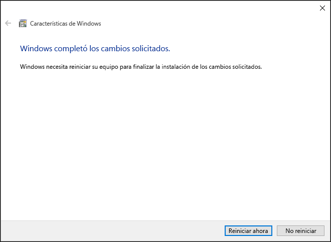
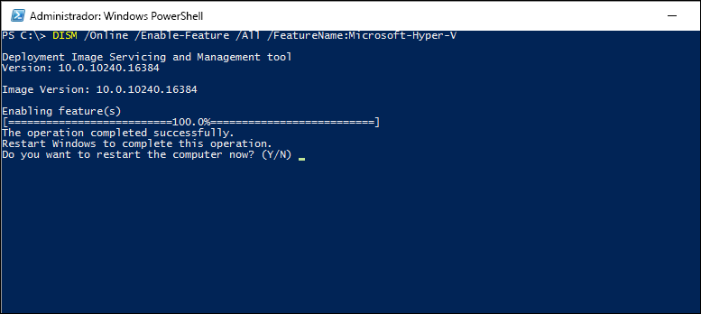

# Instalar Hyper-V en Windows 10

Debe habilitar el rol de Hyper-V para poder crear máquinas virtuales en Windows 10. Esto se puede realizar mediante el panel de control de Windows 10, PowerShell o la herramienta de Administración y mantenimiento de imágenes de implementación (DISM). Este documento explica paso a paso cada uno de ellos.

> Antes de habilitar Hyper-V, asegúrese de que el sistema es compatible. Para obtener más información, consulte [Requisitos de sistema de Hyper-V en Windows 10](https://msdn.microsoft.com/virtualization/hyperv_on_windows/quick_start/walkthrough_compatibility).

## Instalar manualmente el rol de Hyper-V

1. Haga clic con el botón derecho en el botón de Windows y seleccione "Programas y características".

2. Seleccione **Activar o desactivar las características de Windows**.

3. Seleccione **Hyper-V** y haga clic en **Aceptar**.


Cuando la instalación se complete, se le pedirá confirmación para reiniciar el equipo.



## Instalar Hyper-V con PowerShell

1. Abra una consola de PowerShell como administrador.

2. Ejecute el siguiente comando:

```powershell
Enable-WindowsOptionalFeature -Online -FeatureName Microsoft-Hyper-V -All
```
Cuando la instalación se haya completado, deberá reiniciar el equipo.

## Instalar Hyper-V con DISM

La herramienta de Administración y mantenimiento de imágenes de implementación (o DISM) se utiliza para mantener imágenes de Windows y preparar los entornos de preinstalación de Windows. DISM también se puede utilizar para habilitar las características de Windows mientras se ejecuta el sistema operativo. Para obtener más información, consulte [Referencia técnica de DISM](https://technet.microsoft.com/en-us/library/hh824821.aspx).

Para habilitar el rol de Hyper-V mediante DISM:

1. Abra una sesión de PowerShell o CMD como administrador.

2. Escriba el comando siguiente:

```powershell
DISM /Online /Enable-Feature /All /FeatureName:Microsoft-Hyper-V
```



## Siguiente paso: crear un conmutador virtual

[Crear un conmutador virtual](walkthrough_virtual_switch.md)


<!--HONumber=Feb16_HO4-->


