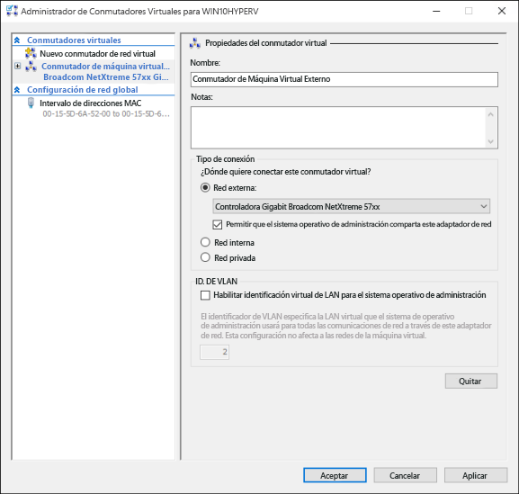
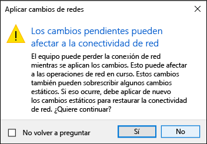

# Crear un conmutador virtual

Antes de crear una máquina virtual de Hyper-V, es posible que quiera proporcionar una método para que esta máquina virtual pueda conectarse a una red física. Hyper-V incluye tecnología de red basada en software que permite que una tarjeta de red de máquina virtual se conecte a un conmutador virtual, con lo que se ofrece conectividad de red. Cada conmutador virtual creado en Hyper-V puede configurarse con uno de tres tipos de conexión:

- **Red externa**: el conmutador virtual se conecta a un adaptador de red físico que ofrece conectividad entre la red física, el host de Hyper-V y la máquina virtual. En esta configuración, también puede habilitar o deshabilitar la capacidad del host de comunicarse a través de la tarjeta de red conectada físicamente. Esto puede ser útil para aislar solamente el tráfico de la máquina virtual en una tarjeta de red física concreta.

- **Red interna**: el conmutador virtual no está conectado a un adaptador de red físico. Pero existe conectividad de red entre el host de Hyper-V y las máquinas virtuales conectadas a este conmutador.

- **Red privada**: el conmutador virtual no está conectado a un adaptador de red físico ni existe conectividad entre el host de Hyper-V y las máquinas virtuales conectadas a este conmutador.

## Crear manualmente un conmutador virtual

Este ejercicio le guía en la creación de un conmutador virtual externo con el Administrador de Hyper-V. Cuando lo complete, el host de Hyper-V contendrá un conmutador virtual que podrá usar para conectar máquinas virtuales a una red física.

1. Abra el Administrador de Hyper-V.

2. Haga clic con el botón derecho en el nombre del host de Hyper-V y seleccione **Administrador de conmutadores virtuales...**

3. En "Conmutadores virtuales", seleccione **Nuevo conmutador de red virtual**.

4. En "¿Qué tipo de conmutador virtual desea crear?", seleccione **Externo**.

5. Seleccione el botón **Crear conmutador virtual**.

6. En "Propiedades del conmutador virtual", asigne un nombre al nuevo conmutador, por ejemplo **Conmutador externo de máquina virtual**.

7. En "Tipo de conexión", asegúrese de que se haya seleccionado **Red externa**.

8. Seleccione la tarjeta de red física que se emparejará con el nuevo conmutador virtual. Esta es la tarjeta de red conectada físicamente a la red.

    

9. Seleccione **Aplicar** para crear el conmutador virtual. En este punto probablemente verá el siguiente mensaje. Haga clic en **Sí** para continuar.

    

10. Seleccione **Aceptar** para cerrar la ventana del administrador de conmutadores virtuales.

## Crear un conmutador virtual con PowerShell

Los pasos siguientes se pueden seguir para crear un conmutador virtual con una conexión externa mediante PowerShell.

1. Use **Get-NetAdapter** para devolver una lista de adaptadores de red conectados al sistema de Windows 10.

    ```powershell
    PS C:\> Get-NetAdapter

    Name                      InterfaceDescription                    ifIndex Status       MacAddress             LinkSpeed
    ----                      --------------------                    ------- ------       ----------             ---------
    Ethernet 2                Broadcom NetXtreme 57xx Gigabit Cont...       5 Up           BC-30-5B-A8-C1-7F         1 Gbps
    Ethernet                  Intel(R) PRO/100 M Desktop Adapter            3 Up           00-0E-0C-A8-DC-31        10 Mbps  
    ```

2. Seleccione el adaptador de red que se usará con el conmutador de Hyper-V y coloque una instancia en una variable denominada **$net**.

    ```
    $net = Get-NetAdapter -Name 'Ethernet'
    ```

3. Ejecute el comando siguiente para crear el nuevo conmutador virtual de Hyper-V.

    ```
    New-VMSwitch -Name "External VM Switch" -AllowManagementOS $True -NetAdapterName $net.Name
    ```

## Portátiles y conmutadores virtuales

Si ejecuta Hyper-V de Windows 10 en un portátil, quizás quiera crear un conmutador virtual para la tarjeta ethernet y la de red inalámbrica. Con esta configuración, puede cambiar las máquinas virtuales entre estos conmutadores según cómo esté conectado a la red el portátil. Las máquinas virtuales no cambiarán automáticamente entre conexión con cable e inalámbrica.

## Siguiente paso: crear una máquina virtual

[Crear una máquina virtual de Windows](walkthrough_create_vm.md)


<!--HONumber=May16_HO2-->


