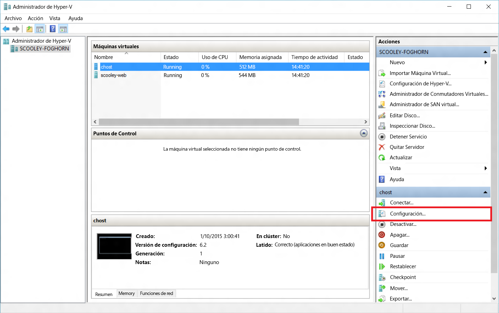
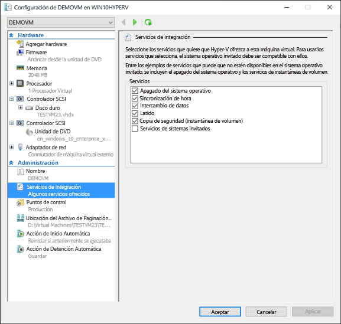
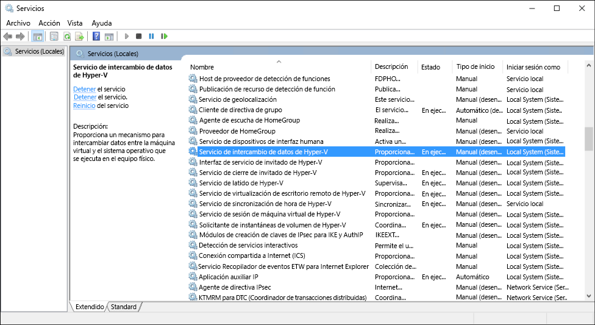

# Administración de los servicios de integración de Hyper-V

Los servicios de integración (también denominados componentes de integración) son servicios que permiten que la máquina virtual se comunique con el host de Hyper-V. Muchos de estos servicios son comodidades (por ejemplo, la copia de archivos de invitado), mientras que otros pueden ser bastante importantes para la capacidad de funcionar correctamente del sistema operativo invitado (la sincronización de la hora).

En este artículo se detalla cómo administrar los servicios de integración con el administrador de Hyper-V y PowerShell en Windows 10. Para más información sobre cada uno de los servicios de integración individuales, consulte [Integration Services]( https://technet.microsoft.com/en-us/library/dn798297.aspx) (Servicios de integración).

## Habilitar o deshabilitar los servicios de integración con el administrador de Hyper-V

1. Seleccione una máquina virtual y abra la configuración.
  
  
2. En la ventana de configuración de la máquina virtual, vaya a la pestaña Servicios de integración en Administración.
  
  
  
  Aquí puede ver todos los servicios de integración disponibles en este host de Hyper-V.  Cabe destacar que el sistema operativo invitado puede admitir o no todos los servicios de integración que se muestran.

## Habilitar o deshabilitar los servicios de integración mediante PowerShell

Los servicios de integración también se pueden habilitar y deshabilitar con PowerShell mediante la ejecución de [`Enable-VMIntegrationService`](https://technet.microsoft.com/en-us/library/hh848500.aspx) y [`Disable-VMIntegrationService`](https://technet.microsoft.com/en-us/library/hh848488.aspx).

En este ejemplo, se habilitará y luego deshabilitará el servicio de integración de copia de archivos de invitado en la máquina virtual "demovm" que se vio anteriormente.

1. Ver los servicios de integración que se están ejecutando
  
  ``` PowerShell
  Get-VMIntegrationService -VMName "demovm"
  ```

  El resultado tendrá este aspecto:  
  ``` PowerShell
  VMName      Name                    Enabled PrimaryStatusDescription SecondaryStatusDescription
  ------      ----                    ------- ------------------------ --------------------------
  demovm      Guest Service Interface False   OK
  demovm      Heartbeat               True    OK                       OK
  demovm      Key-Value Pair Exchange True    OK
  demovm      Shutdown                True    OK
  demovm      Time Synchronization    True    OK
  demovm      VSS                     True    OK
  ```

2. Habilite el servicio de integración `Guest Service Interface`.

   ``` PowerShell
   Enable-VMIntegrationService -VMName "demovm" -Name "Guest Service Interface"
   ```
   
   Si ejecuta `Get-VMIntegrationService -VMName "demovm"`, verá que el servicio de integración Guest Service Interface está habilitado.
 
3. Deshabilite el servicio de integración `Guest Service Interface`.

   ``` PowerShell
   Disable-VMIntegrationService -VMName "demovm" -Name "Guest Service Interface"
   ```
   
Los servicios de integración se han diseñado de forma que deben habilitarse tanto en el host como en el invitado para poder funcionar.  Aunque todos los servicios de integración están habilitados de forma predeterminada en los sistemas operativos invitados de Windows, pueden deshabilitarse.  Vea cómo en la sección siguiente.


## Administrar los servicios de integración de sistema operativo invitado (Windows)

> **Nota:** La deshabilitación de los servicios de integración puede afectar gravemente a la capacidad del host para administrar máquinas virtuales.  Los servicios de integración deben habilitarse en el host y en el invitado para funcionar.

Los servicios de integración aparecen como servicios en Windows. Para habilitar o deshabilitar un servicio de integración desde dentro de la máquina virtual, abra el administrador de servicios de Windows.

 

Busque los servicios que contengan Hyper-V en el nombre. Haga clic con el botón derecho en el servicio que quiera habilitar o deshabilitar e inicie o detenga el servicio.

De forma alternativa, para ver todos los servicios de integración con PowerShell, ejecute:

```PowerShell
Get-Service -Name vm*
```

que devolverá una lista de aspecto similar a la siguiente:

```PowerShell
Status   Name               DisplayName
------   ----               -----------
Running  vmicguestinterface Hyper-V Guest Service Interface
Running  vmicheartbeat      Hyper-V Heartbeat Service
Running  vmickvpexchange    Hyper-V Data Exchange Service
Running  vmicrdv            Hyper-V Remote Desktop Virtualizati...
Running  vmicshutdown       Hyper-V Guest Shutdown Service
Running  vmictimesync       Hyper-V Time Synchronization Service
Stopped  vmicvmsession      Hyper-V VM Session Service
Running  vmicvss            Hyper-V Volume Shadow Copy Requestor
```

Inicie o detenga los servicios mediante [`Start-Service`](https://technet.microsoft.com/en-us/library/hh849825.aspx) o [`Stop-Service`](https://technet.microsoft.com/en-us/library/hh849790.aspx).

Por ejemplo, para deshabilitar PowerShell Direct, puede ejecutar `Stop-Service -Name vmicvmsession`.

De forma predeterminada, todos los servicios de integración están habilitados en el sistema operativo invitado.

## Administrar servicios de integración del sistema operativo invitado (Linux)

Los servicios de integración de Linux normalmente se ofrecen a través del kernel de Linux.

Compruebe si se están ejecutando el controlador de servicio de integración y los demonios con los comandos siguientes en el sistema operativo invitado Linux.

1. El controlador de servicios de integración de Linux se denomina "hv_utils".  Ejecute lo siguiente para ver si está cargado.

  ``` BASH
  lsmod | grep hv_utils
  ``` 
  
  La salida debe parecerse a lo siguiente:  
  
  ``` BASH
  Module                  Size   Used by
  hv_utils               20480   0
  hv_vmbus               61440   8 hv_balloon,hyperv_keyboard,hv_netvsc,hid_hyperv,hv_utils,hyperv_fb,hv_storvsc
  ```

2. Ejecute el comando siguiente en el sistema operativo invitado Linux para ver si se están ejecutando los demonios necesarios.
  
  ``` BASH
  ps -ef | grep hv
  ```
  
  La salida debe parecerse a lo siguiente:  
  
  ``` BASH
  root       236     2  0 Jul11 ?        00:00:00 [hv_vmbus_con]
  root       237     2  0 Jul11 ?        00:00:00 [hv_vmbus_ctl]
  ...
  root       252     2  0 Jul11 ?        00:00:00 [hv_vmbus_ctl]
  root      1286     1  0 Jul11 ?        00:01:11 /usr/lib/linux-tools/3.13.0-32-generic/hv_kvp_daemon
  root      9333     1  0 Oct12 ?        00:00:00 /usr/lib/linux-tools/3.13.0-32-generic/hv_kvp_daemon
  root      9365     1  0 Oct12 ?        00:00:00 /usr/lib/linux-tools/3.13.0-32-generic/hv_vss_daemon
  scooley  43774 43755  0 21:20 pts/0    00:00:00 grep --color=auto hv          
  ```
  
  Para ver los demonios que están disponibles, ejecute:
  ``` BASH
  compgen -c hv_
  ```
  
  La salida debe parecerse a lo siguiente:
  
  ``` BASH
  hv_vss_daemon
  hv_get_dhcp_info
  hv_get_dns_info
  hv_set_ifconfig
  hv_kvp_daemon
  hv_fcopy_daemon     
  ```
  
  Los demonios de servicio de integración que puede ver:  
  * **`hv_vss_daemon`**: este demonio es necesario para crear copias de seguridad de máquinas virtuales de Linux dinámicas.
  * **`hv_kvp_daemon`**: este demonio permite establecer y consultar pares clave-valor tanto intrínsecos como extrínsecos.
  * **`hv_fcopy_daemon`**: este demonio implementa un servicio de copia de archivos entre el host y el invitado.

> **Nota:** Si los demonios de servicios de integración anteriores no están disponibles, puede deberse a que no sean compatibles con el sistema o a que no estén instalados.  [Aquí](https://technet.microsoft.com/en-us/library/dn531030.aspx) encontrará más información específica al respecto.  

En este ejemplo, se detendrá e iniciará el demonio KVP `hv_kvp_daemon`.

Detenga el proceso del demonio con el pid (id. de proceso) ubicado en la segunda columna de la salida anterior.  Como alternativa, puede encontrar el proceso adecuado con `pidof`.  Como los demonios de Hyper-V se ejecutan como raíz, necesitará permisos de raíz.

``` BASH
sudo kill -15 `pidof hv_kvp_daemon`
```

Ahora, si vuelve a ejecutar `ps -ef | hv`, descubrirá que todos los procesos de `hv_kvp_daemon` han desaparecido.

Para iniciar el demonio de nuevo, ejecute el demonio como raíz.

``` BASH
sudo hv_kvp_daemon
``` 

Ahora, si vuelve a ejecutar `ps -ef | hv`, descubrirá un proceso de `hv_kvp_daemon` con un nuevo Id. de proceso.


## Mantenimiento del servicio de integración

Mantenga los servicios de integración actualizados con el fin de obtener el mejor rendimiento y las mejores características posibles de la máquina virtual.

**Para máquinas virtuales que se ejecutan en hosts de Windows 10:**

> **Nota:** El archivo de imagen ISO vmguest.iso ya no es necesario para actualizar los componentes de integración. No se incluye con Hyper-V en Windows 10.

| SO invitado | Mecanismo de actualización | Notas |
|:---------|:---------|:---------|
| Windows 10 | Windows Update | |
| Windows 8.1 | Windows Update | |
| Windows 8 | Windows Update | Requiere el Servicio de integración de intercambio de datos.* |
| Windows 7 | Windows Update | Requiere el Servicio de integración de intercambio de datos.* |
| Windows Vista (SP 2) | Windows Update | Requiere el Servicio de integración de intercambio de datos.* |
| - | | |
| Windows Server 2012 R2 | Windows Update | |
| Windows Server 2012 | Windows Update | Requiere el Servicio de integración de intercambio de datos.* |
| Windows Server 2008 R2 (SP 1) | Windows Update | Requiere el Servicio de integración de intercambio de datos.* |
| Windows Server 2008 (SP 2) | Windows Update | Soporte extendido solo en Server 2016 ([más información](https://support.microsoft.com/en-us/lifecycle?p1=12925)). |
| Windows Home Server 2011 | Windows Update | No se admite en Server 2016 ([más información](https://support.microsoft.com/en-us/lifecycle?p1=15820)). |
| Windows Small Business Server 2011 | Windows Update | No se admite con el soporte estándar ([más información](https://support.microsoft.com/en-us/lifecycle?p1=15817)). |
| - | | |
| Invitados Linux | administrador de paquetes | Los componentes de integración de Linux están integrados en la distribución, pero puede que haya actualizaciones opcionales. ******** |

>  \* Si no se puede habilitar el Servicio de integración de intercambio de datos, los componentes de integración de estos invitados están disponibles [aquí](https://support.microsoft.com/en-us/kb/3071740) en forma de archivo .cab en el centro de descarga.  
  Las instrucciones para aplicar un archivo .cab están disponibles [aquí](http://blogs.technet.com/b/virtualization/archive/2015/07/24/integration-components-available-for-virtual-machines-not-connected-to-windows-update.aspx).


**Para las máquinas virtuales que se ejecutan en hosts de Windows 8.1:**

| SO invitado | Mecanismo de actualización | Notas |
|:---------|:---------|:---------|
| Windows 10 | Windows Update | |
| Windows 8.1 | Windows Update | |
| Windows 8 | Disco de servicios de integración | |
| Windows 7 | Disco de servicios de integración | |
| Windows Vista (SP 2) | Disco de servicios de integración | |
| Windows XP (SP 2, SP 3) | Disco de servicios de integración | |
| - | | |
| Windows Server 2012 R2 | Windows Update | |
| Windows Server 2012 | Disco de servicios de integración | |
| Windows Server 2008 R2 | Disco de servicios de integración | |
| Windows Server 2008 (SP 2) | Disco de servicios de integración | |
| Windows Home Server 2011 | Disco de servicios de integración | |
| Windows Small Business Server 2011 | Disco de servicios de integración | |
| Windows Server 2003 R2 (SP 2) | Disco de servicios de integración | |
| Windows Server 2003 (SP 2) | Disco de servicios de integración | |
| - | | |
| Invitados Linux | administrador de paquetes | Los componentes de integración de Linux están integrados en la distribución, pero puede que haya actualizaciones opcionales. ** |


**Para las máquinas virtuales que se ejecutan en hosts de Windows 8:**

| SO invitado | Mecanismo de actualización | Notas |
|:---------|:---------|:---------|
| Windows 8.1 | Windows Update | |
| Windows 8 | Disco de servicios de integración | |
| Windows 7 | Disco de servicios de integración | |
| Windows Vista (SP 2) | Disco de servicios de integración | |
| Windows XP (SP 2, SP 3) | Disco de servicios de integración | |
| - | | |
| Windows Server 2012 R2 | Windows Update | |
| Windows Server 2012 | Disco de servicios de integración | |
| Windows Server 2008 R2 | Disco de servicios de integración | |
| Windows Server 2008 (SP 2) | Disco de servicios de integración | |
| Windows Home Server 2011 | Disco de servicios de integración | |
| Windows Small Business Server 2011 | Disco de servicios de integración | |
| Windows Server 2003 R2 (SP 2) | Disco de servicios de integración | |
| Windows Server 2003 (SP 2) | Disco de servicios de integración | |
| - | | |
| Invitados Linux | administrador de paquetes | Los componentes de integración de Linux están integrados en la distribución, pero puede que haya actualizaciones opcionales. ** |


Las instrucciones para realizar la actualización a través del disco de Servicios de integración para Windows 8 y Windows 8.1 están disponibles [aquí](https://technet.microsoft.com/en-us/library/hh846766.aspx#BKMK_step4).

 > ** [Aquí](https://technet.microsoft.com/en-us/library/dn531030.aspx) encontrará más información sobre los invitados Linux. 


<!--HONumber=Jun16_HO3-->


