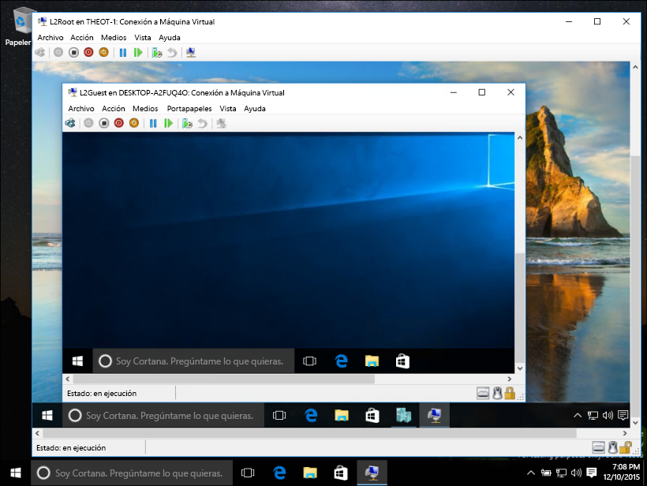
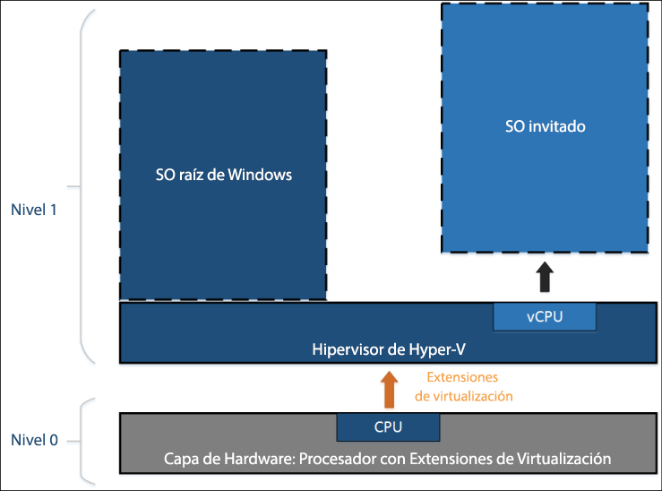
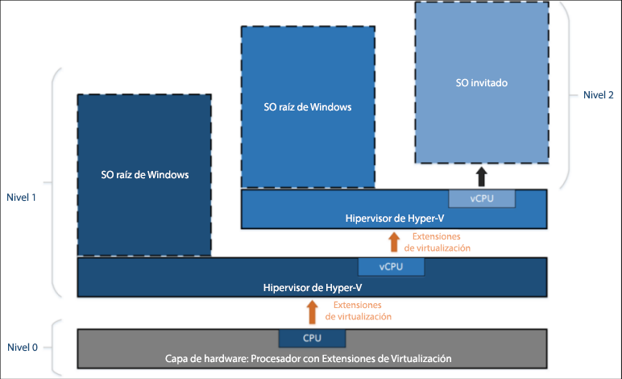

# Virtualización anidada

> **Nota:** Esta característica de vista previa anticipada solo está disponible para Windows Insiders que ejecuten la compilación 10565 o una versión posterior y no incluye garantías de rendimiento o estabilidad.

La virtualización anidada es virtualización en ejecución dentro de un entorno virtualizado. En otras palabras, el anidamiento permite ejecutar el rol de servidor de Hyper-V en una máquina virtual.



Hyper-V se basa en la compatibilidad de virtualización de hardware (por ejemplo, Intel VT-x y AMD-V) para ejecutar máquinas virtuales. Normalmente, cuando se ha instalado Hyper-V, el hipervisor oculta esta capacidad a las máquinas virtuales invitadas. Esto impide que las máquinas virtuales invitadas ejecuten el rol de servidor de Hyper-V entre otros hipervisores.

La virtualización anidada expone dichos componentes de compatibilidad de virtualización de hardware a la máquina virtual invitada.

En el diagrama siguiente se muestra Hyper-V sin anidamiento. El hipervisor de Hyper-V toma el control completo de las extensiones de virtualización de hardware (flecha naranja) y no las expone al sistema operativo invitado.



En cambio, en el diagrama siguiente se muestra Hyper-V con anidamiento. En este caso, Hyper-V expone las extensiones de virtualización de hardware a sus máquinas virtuales. Con el anidamiento habilitado, una máquina virtual invitada puede instalar su propio hipervisor y ejecutar sus propias máquinas virtuales invitadas.



## Requisitos de virtualización anidada

Antes de habilitar la virtualización anidada, tenga en cuenta que se trata de una vista previa. No utilice el anidamiento en entornos de producción.

Requisitos:
* Mínimo de 4 GB de RAM disponible. La virtualización anidada requiere una gran cantidad de memoria.
* Ambos hipervisores deben ser la compilación de Windows Insider más reciente (10565 o posterior). Otros hipervisores no funcionarán.
* Esta característica actualmente es solo para Intel. Se requiere Intel VT-x.

## Habilitar la virtualización anidada

1. Cree una máquina virtual con la misma compilación que el host. [Las instrucciones se encuentran aquí](../quick_start/walkthrough_create_vm.md).

2. Ejecute [este script](https://github.com/Microsoft/Virtualization-Documentation/blob/master/hyperv-tools/Nested/Enable-NestedVm.ps1) como administrador en el host de Hyper-V.

    En esta presentación preliminar, el anidamiento incluye unos requisitos de configuración. Para facilitar las cosas, [este script de PowerShell](https://github.com/Microsoft/Virtualization-Documentation/blob/master/hyperv-tools/Nested/Enable-NestedVm.ps1) comprobará la configuración, cambiará lo que no sea correcto y habilitará la virtualización anidada para la máquina virtual especificada.

  ``` PowerShell
  Invoke-WebRequest https://raw.githubusercontent.com/Microsoft/Virtualization-Documentation/master/hyperv-tools/Nested/Enable-NestedVm.ps1 -OutFile ~/Enable-NestedVm.ps1 
  ~/Enable-NestedVm.ps1 -VmName "DemoVM"
  ```

3. Instale Hyper-V en la máquina virtual.

  ``` PowerShell
  Invoke-Command -VMName "DemoVM" -ScriptBlock { Enable-WindowsOptionalFeature -FeatureName Microsoft-Hyper-V -Online; Restart-Computer }
  ```

4. Cree las máquinas virtuales anidadas.

## Problemas conocidos

A continuación se muestra una lista de problemas conocidos:
* Los hosts con Device Guard habilitado no pueden exponer las extensiones de virtualización a los invitados.

* Los hosts con seguridad basada en la virtualización (VBS) habilitada no pueden exponer las extensiones de virtualización a los invitados. Primero debe deshabilitar VBS para obtener una vista previa de la virtualización anidada.

* Cuando se habilite la virtualización anidada en una máquina virtual, las siguientes características ya no serán compatibles con esa máquina virtual.  
    Estas acciones producirán un error o provocarán que la máquina virtual no se inicie si hospeda otras máquinas virtuales:
    * La memoria dinámica debe estar desactivada. Esto impedirá que la máquina virtual se arranque.
    * El cambio de tamaño de memoria en tiempo de ejecución producirá un error.
    * La aplicación de puntos de control en una máquina virtual producirá un error.
    * La migración en vivo producirá un error; en otras palabras, una máquina virtual que hospede otras máquinas virtuales no se puede migrar en vivo.
    * Guardar o restaurar producirán un error.

    > **Nota:** Estas características seguirán funcionando en la máquina virtual invitada "más interna". Las restricciones solo se aplican a la máquina virtual de la primera capa.

* Cuando se habilita la virtualización anidada, la suplantación de direcciones MAC debe estar habilitada en la máquina virtual para que las redes funcionen en los invitados "más internos".

## Preguntas más frecuentes y solución de problemas

### Mi máquina virtual no se inicia, ¿qué debo hacer?

1. Asegúrese de que la memoria dinámica esté desactivada.
2. Ejecute este script de PowerShell en el equipo host desde un símbolo de sistema con privilegios elevados.

    Este script le indica si el host y las máquinas virtuales están configurados correctamente para anidarse.

  ``` PowerShell
  Invoke-WebRequest https://raw.githubusercontent.com/Microsoft/Virtualization-Documentation/master/hyperv-tools/Nested/Get-NestedVirtStatus.ps1 -OutFile ~/Get-NestedVirtStatus.ps1 
  ~/Get-NestedVirtStatus.ps1
  ```

### Conexión a máquina virtual se pierde una y otra vez.

Si está utilizando una contraseña en blanco, se trata de un problema conocido. Cambie su contraseña y el problema debería solucionarse.

### Mi problema no aparece aquí.

¿No ve su problema? ¿Tiene comentarios? Póngase en contacto con nosotros.

Infórmenos a través de la aplicación de comentarios de Windows, los [foros de virtualización](https://social.technet.microsoft.com/Forums/windowsserver/En-us/home?forum=winserverhyperv) o mediante [GitHub](https://github.com/Microsoft/Virtualization-Documentation).


