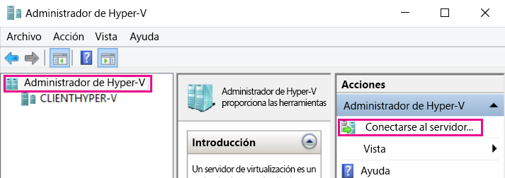
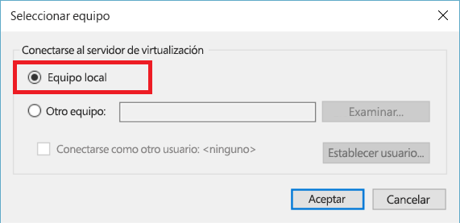
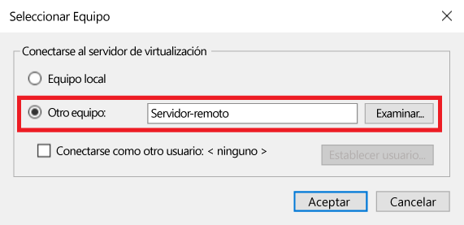
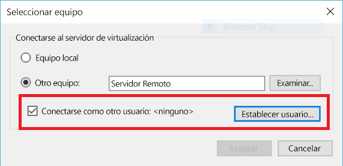

# Administrar hosts remotos de Hyper-V con el Administrador de Hyper-V

El Administrador de Hyper-V es una herramienta incluida de forma predeterminada para diagnosticar y administrar el host de Hyper-V local y un pequeño número de hosts remotos. En este artículo se documentan los pasos de configuración para conectarse a los hosts de Hyper-V con el Administrador de Hyper-V en todas las configuraciones admitidas.

> El Administrador de Hyper-V está disponible en **Programas y características** como **Herramientas de administración de Hyper-V** en [cualquier sistema operativo de Windows que incluya Hyper-V](../quick_start/walkthrough_compatibility.md#OperatingSystemRequirements). No es necesario habilitar la plataforma de Hyper-V para administrar los hosts remotos.

Para conectarse a un host de Hyper-V en el Administrador de Hyper-V, asegúrese de que se seleccionó **Administrador de Hyper-V** en el panel izquierdo y luego seleccione **Conectarse al servidor...** en el panel derecho.



## Combinaciones de hosts de Hyper-V compatibles con el Administrador de Hyper-V

El Administrador de Hyper-V en Windows 10 le permite administrar los siguientes hosts de Hyper-V:
* Windows 10
* Windows 8.1
* Windows 8
* Windows Server 2016 + Windows Server Core, Nano Server e Hyper-V Server
* Windows Server 2012 R2 + Windows Server Core, Datacenter y Hyper-V Server
* Windows 2012 + Windows Server Core, Datacenter y Hyper-V Server

El Administrador de Hyper-V en Windows 8.1 y Windows Server 2012 R2 le permite administrar:
* Windows 8.1
* Windows 8
* Windows Server 2012 R2 + Windows Server Core, Datacenter y Hyper-V Server
* Windows 2012 + Windows Server Core, Datacenter y Hyper-V Server

El Administrador de Hyper-V en Windows 8 y Windows Server 2012 le permite administrar:
* Windows 8
* Windows 2012 + Windows Server Core, Datacenter y Hyper-V Server

Hyper-V comenzó a estar disponible con Windows en Windows 8. Antes de Windows 8.1 y Server 2012, el Administrador de Hyper-V solo se ocupaba de versiones coincidentes de Hyper-V.

> **Nota:** La funcionalidad del Administrador de Hyper-V coincide con la funcionalidad disponible para la versión que se está administrando. En otras palabras, si está administrando un host remoto de Server 2012 desde Server 2012R2, las nuevas herramientas del Administrador de Hyper-V de 2012R2 no estarán disponibles.

## Administrar localhost

Para agregar localhost al Administrador de Hyper-V como un host de Hyper-V, seleccione **Equipo local** en el cuadro de diálogo **Seleccionar equipo**.



Si no se puede establecer una conexión:
*  Asegúrese de que el rol de la plataforma Hyper-V está habilitado.  
  Consulte la [sección del tutorial para la comprobación de la compatibilidad](../quick_start/walkthrough_compatibility.md) a fin de ver si se admite Hyper-V.
*  Confirme que su cuenta de usuario forma parte del grupo Administrador de Hyper-V.


## Administrar otro host de Hyper-V en el mismo dominio

Para agregar un host remoto de Hyper-V al Administrador de Hyper-V, seleccione **Otro equipo** en el cuadro de diálogo **Seleccionar equipo** y escriba el nombre de host, NetBIOS o FQDN del host remoto en el campo de texto.



Para administrar los hosts remotos de Hyper-V, debe habilitar la administración remota en el equipo local y el host remoto.

Puede hacerlo a través de `Propiedades del sistema -> Configuración de administración remota` o ejecutando el siguiente comando de PowerShell como administrador:

``` PowerShell
winrm quickconfig
```

Si su cuenta de usuario actual coincide con una cuenta de administrador de Hyper-V en el host remoto, continúe y pulse **Aceptar** para conectarse.

> Esta es la única manera admitida para administrar un host remoto en el Administrador de Hyper-V en Windows 8 o Windows 8.1.


Windows 10 amplió enormemente las combinaciones posibles de tipos de conexiones remotas.  
Ahora puede conectarse a un sistema operativo Windows 10 remoto o una versión posterior con el nombre de host o la dirección IP. El Administrador de Hyper-V ahora también admite credenciales de usuario alternativas.


### Conectarse al host remoto como un usuario diferente

> Solo está disponible cuando se conecte a un host remoto de Windows 10 o Server 2016 Technical Preview 3 o una versión posterior.

En Windows 10, si no se ejecuta con la cuenta de usuario correcta para el host remoto, puede conectarse como otro usuario con credenciales alternativas.

Para especificar las credenciales del host remoto de Hyper-V, seleccione **Conectarse como otro usuario: ** en el cuadro de diálogo ** Seleccionar equipo** y luego seleccione **Establecer usuario...**.




### Conectarse al host remoto mediante la dirección IP

> Solo está disponible cuando se conecte a un host remoto de Windows 10 o Server 2016 Technical Preview 3 o una versión posterior.

A veces es más fácil conectarse mediante la dirección IP en lugar del nombre del host. Windows 10 le permite hacer exactamente eso.

Para conectarse mediante la dirección IP, escriba la dirección IP en el campo de texto **Otro equipo**.


## Administrar un host de Hyper-V fuera de su dominio (o sin dominio)

> Solo está disponible cuando se conecte a un host remoto de Windows 10 o Server 2016 Technical Preview 3 o una versión posterior.

En el Host de Hyper-V que se va a administrar, ejecute lo siguiente como administrador:

1.  [Enable-PSRemoting](https://technet.microsoft.com/en-us/library/hh849694.aspx)
  * [Enable-PSRemoting](https://technet.microsoft.com/en-us/library/hh849694.aspx) creará las reglas de firewall necesarias para las zonas de red *privadas*. Para permitir este acceso en zonas públicas, deberá habilitar las reglas para CredSSP y WinRM.
2. Set-Item WSMan:\localhost\Client\TrustedHosts -value "fqdn-of-managing-pc"
  * Como alternativa, puede permitir que todos los hosts sean de confianza para administrarlos mediante:
  * Set-Item WSMan:\localhost\Client\TrustedHosts -value * -force
3. [Enable-WSManCredSSP](https://technet.microsoft.com/en-us/library/hh849872.aspx) -Role client -DelegateComputer "fqdn-of-managing-pc"
  * Como alternativa, puede permitir que todos los hosts sean de confianza para administrarlos mediante:
  * [Enable-WSManCredSSP](https://technet.microsoft.com/en-us/library/hh849872.aspx) -Role client -DelegateComputer *


<!--HONumber=May16_HO1-->


