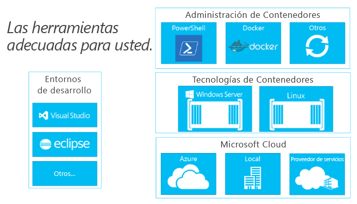

# Creación de un ecosistema de contenedor

Para entender por qué es tan importante la creación de un ecosistema de contenedor, primero se explicará Docker.

## La importancia de Docker

El concepto de contenedores (aislamiento de espacio de nombres y gobernanza de recursos) ha estado presente durante mucho tiempo, en la época de BSD Jails, Solaris Zones y el mecanismo básico de UNIX chroot (cambiar raíz).   Lo que Docker ha hecho es ofrecer un conjunto común de herramientas, un modelo de empaquetado y un mecanismo de implementación.  Con ello, Docker ha simplificado en gran medida la inclusión en contenedores y la distribución de aplicaciones.  Esas aplicaciones pueden entonces ejecutarse en cualquier lugar de cualquier host de Linux, una capacidad que ofrecemos también en Windows.

Esta tecnología ubicua no solo simplifica la administración al ofrecer los mismos comandos de administración para cualquier host, sino que también crea una oportunidad única para las operaciones de desarrollo continuas.

Del escritorio de un desarrollador a una máquina de pruebas para un conjunto de equipos de producción, se puede crear una imagen de Docker que se implementará exactamente igual en cualquier entorno en segundos. Este artículo ha creado un ecosistema grande y en crecimiento de aplicaciones empaquetadas en contenedores de Docker, con DockerHub, el registro público de aplicaciones en contenedores que mantiene Docker.

Docker ofrece una base estupenda para el desarrollo.

Hablemos ahora de ese ecosistema de aplicaciones y de cómo puede basarse en los conceptos de Docker para crear un flujo de trabajo de desarrollo e implementación que se adapte a sus necesidades.

## Componentes de un ecosistema de contenedores

Los contenedores de Windows son un componente clave de un ecosistema de grandes contenedores. Estamos trabajando en el sector para ofrecer opciones a los desarrolladores en cada nivel de la pila de soluciones.

El ecosistema de contenedores ofrece maneras de administrar contenedores, compartirlos y desarrollar aplicaciones que se ejecutan en ellos.

Microsoft quiere impulsar las opciones de los desarrolladores y la productividad a medida que crean estas aplicaciones de última generación.  Nuestro objetivo es aumentar la productividad del desarrollador, que supone permitir que las aplicaciones tengan como destino cualquier nube de Microsoft, sin tener que modificar, reescribir o volver a configurar el código.

Microsoft tiene un gran compromiso con ser abierto y contribuir al ecosistema.  Colaboramos activamente con la llegada simultánea de ecosistemas de varios desarrolladores de interés, como Windows y Linux, para impulsar la innovación.

Durante los próximos meses, ofreceremos más información sobre las asociaciones adicionales de este ecosistema en desarrollo.

<!--HONumber=Jun16_HO4-->

