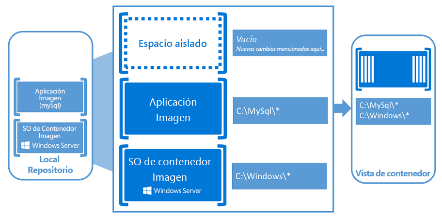

# Contenedores en Windows

## Qué son los contenedores

Los contenedores son una forma de encapsular una aplicación en su propio espacio aislado. Una vez que la aplicación esté en su contenedor, no tendrá conocimiento de otras aplicaciones o procesos que existan fuera de su espacio. Todo lo que necesita la aplicación para ejecutarse correctamente también se encuentra dentro de este contenedor.  Independientemente de la ubicación a la que se pueda mover el espacio, la aplicación siempre se encontrará satisfecha porque incluye todo lo que necesita para ejecutarse.

Imagina una cocina. Empaquetamos todos los electrodomésticos y mobiliario, cacerolas y sartenes, jabón para vajilla y toallas de mano. Este es nuestro contenedor.

Ahora podemos tomar este contenedor y colocarlo en el apartamento que queramos, y tendremos la misma cocina. Todo lo que debemos hacer es conectar la electricidad y agua a ella y, a continuación, estamos listos para empezar a cocinar (porque tenemos todos los electrodomésticos que necesitamos).

De forma muy similar, los contenedores se parecen a esta cocina. Es posible que haya diferentes tipos de habitaciones, así como un gran número de los mismos tipos de habitaciones. Lo importante es que los contenedores incluyan todo lo que necesitan.

Vea una breve introducción a continuación:
<iframe width="800" height="450" src="https://www.youtube.com/embed/Ryx3o0rD5lY" frameborder="0" allow="accelerometer; autoplay; encrypted-media; gyroscope; picture-in-picture" allowfullscreen></iframe>

## Conceptos básicos de los contenedores

Los contenedores son un entorno de ejecución portátil, aislado y controlado por recursos que se ejecuta en una máquina host o virtual. Una aplicación o proceso que se ejecuta en un contenedor se empaqueta con todas las dependencias necesarias y los archivos de configuración; ha dado la ilusión de que no hay otros procesos que se ejecutan fuera del contenedor.

El host del contenedor aprovisiona un conjunto de recursos para el contenedor y este solo usará estos recursos. Lo respecta el contenedor, no existen otros recursos fuera de lo que se le ha asignado y, por tanto, el contenedor no puede acceder a los recursos que pueden haber aprovisionado un contenedor vecino.

Los siguientes conceptos clave te resultarán útiles cuando empieces a crear y trabajar con contenedores de Windows.

**Host de contenedor:** equipo físico o virtual configurado con la característica de contenedor de Windows. El host de contenedor ejecutará uno o varios contenedores de Windows.

**Imagen de contenedor:** a medida que se realicen modificaciones en un registro o un sistema de archivos de contenedores, como durante la instalación de software, se capturan en un espacio aislado. En muchos casos, querrás capturar este estado de forma que se puedan crear nuevos contenedores que heredan estos cambios. Precisamente eso es una imagen: cuando se ha detenido el contenedor, puede descartar ese espacio aislado o puede convertirlo en una nueva imagen de contenedor. Por ejemplo, imaginemos que ha implementado un contenedor a partir de la imagen del sistema operativo de Windows Server Core. Después instala MySQL en este contenedor. La creación de una nueva imagen de este contenedor actuaría como una versión que se puede implementar del contenedor. Esta imagen solo contendría los cambios realizados (MySQL), aunque funcionaría como una capa encima de la imagen del sistema operativo del contenedor.

**Espacio aislado:** cuando se haya iniciado un contenedor, todas las acciones de escritura como las modificaciones del sistema de archivos, las modificaciones del Registro o las instalaciones de software se capturan en esta capa de "espacio aislado".

**Imagen del sistema operativo de contenedor:** los contenedores se implementan a partir de imágenes. La imagen del sistema operativo de contenedor es la primera capa de potencialmente muchas capas de imagen que componen un contenedor. Esta imagen ofrece el entorno del sistema operativo. Una imagen de sistema operativo del contenedor es inmutable. Es decir, no se puede modificar.

**Repositorio de contenedor:** cada vez que se crea una imagen de contenedor, esta y sus dependencias se almacenan en un repositorio local. Estas imágenes se pueden reutilizar muchas veces en el host de contenedor. Las imágenes de contenedor también pueden almacenarse en un registro público o privado, como DockerHub, de forma que se puedan usar en varios hosts de contenedor diferentes.

Para alguien familiarizado con las máquinas virtuales, puede parecer que los contenedores son increíblemente similares. Un contenedor ejecuta un sistema operativo, tiene un sistema de archivos y se puede acceder a él a través de una red, como si fuese un equipo físico o virtual. Dicho esto, la tecnología y los conceptos relacionados con los contenedores son muy diferentes de las máquinas virtuales.

Mark Russinovich, experto de MicrosoftAzure, tiene [una estupenda entrada de blog](https://azure.microsoft.com/en-us/blog/containers-docker-windows-and-trends/) en la que explica las diferencias.

## Tipos de contenedores de Windows

Los contenedores de Windows incluyen dos tipos diferentes de contenedores o tiempos de ejecución.

**Contenedores de Windows Server**: Proporcionan aislamiento de aplicaciones mediante tecnología de aislamiento de procesos y espacios de nombres. Un contenedor de Windows Server comparte el kernel con el host de contenedor y con todos los contenedores que se ejecutan en el host. Estos contenedores no proporcionan un límite de seguridad hostil y no deben usarse para aislar un código que no sea de confianza. Dado el espacio de kernel compartido, estos contenedores requieren la misma configuración y versión de kernel.

**Aislamiento de Hyper-V**: amplía el aislamiento que ofrecen los contenedores de WindowsServer mediante la ejecución de cada contenedor en una máquina virtual altamente optimizada. En esta configuración, el kernel del host de contenedor no se comparte con otros contenedores que estén en el mismo host. Estos contenedores se han diseñado para el hospedaje multiinquilino hostil con las mismas garantías de seguridad de una máquina virtual. Dado que estos contenedores no comparten el kernel con el host u otros contenedores del equipo host, pueden ejecutar kernels con distintas versiones y configuraciones (dentro de las versiones compatibles): por ejemplo, todos los contenedores de Windows en Windows10 usan el aislamiento de Hyper-V para poder usar la versión y configuración del kernel de WindowsServer.

La ejecución de un contenedor en Windows con o sin aislamiento de Hyper-V es una decisión que ha de tomarse en el tiempo de ejecución. Puedes optar por crear inicialmente el contenedor con aislamiento de Hyper-V y más adelante, en el tiempo de ejecución, seleccionarlo para ejecutarlo en lugar de un contenedor de WindowsServer.

## ¿Qué es Docker?

A medida que lees sobre los contenedores, inevitablemente aparecerá Docker en tu lectura. Docker es el contenedor mediante el que se empaquetan y entregan las imágenes de contenedor. Este proceso automatizado genera imágenes (plantillas) que pueden ejecutarse en cualquier lugar (en entornos locales, en la nube o en un equipo personal) como contenedor.

Al igual que cualquier otro contenedor, un contenedor de WindowsServer puede administrarse con [Docker](https://www.docker.com).

## Contenedores para desarrolladores ##

Del escritorio de un desarrollador a una máquina de pruebas para un conjunto de máquinas de producción, se puede crear una imagen de Docker que se implementará exactamente igual en cualquier entorno en segundos. Este artículo ha creado un gran ecosistema en crecimiento de aplicaciones empaquetadas en contenedores de Docker, con DockerHub, el registro de aplicaciones en contenedores públicos que mantiene Docker. Actualmente hay publicadas más de 180000 aplicaciones en el repositorio público de la comunidad.

Cuando incluya una aplicación en un contenedor, solamente la aplicación y los componentes necesarios para ejecutarla se combinan en una "imagen". Los contenedores se crean después a partir de esta imagen según sea necesario. También puede utilizar una imagen como una línea de base para crear otra imagen, con lo que la creación de imágenes será aún más rápida. Varios contenedores pueden compartir la misma imagen, lo que significa que los contenedores se inician con mucha rapidez y utilizan menos recursos. Por ejemplo, puede utilizar los contenedores para poner en marcha componentes de aplicaciones portátiles y ligeros (o "microservicios") para aplicaciones distribuidas y escalar rápidamente cada servicio por separado.

Como el contenedor tiene todo que lo necesario para ejecutar la aplicación, son muy portátiles y se pueden ejecutar en cualquier equipo que tenga Windows Server 2016. Puede crear y probar contenedores localmente y luego implementar esa misma imagen de contenedor en la nube privada, la nube pública o el proveedor de servicios de su empresa. La agilidad natural de los contenedores admite patrones de desarrollo de aplicaciones modernas en entornos de nube, virtualizados y a gran escala.

Con los contenedores, los desarrolladores pueden crear una aplicación en cualquier lenguaje. Estas aplicaciones son totalmente portátiles y pueden ejecutarse en cualquier lugar (portátil, equipo de escritorio, servidor, nube privada, nube pública o proveedor de servicios) sin cambios de código.  

Los contenedores ayudan a los desarrolladores a crear y distribuir aplicaciones de mayor calidad, más rápido.

## Contenedores para los profesionales de TI ##

Los profesionales de TI pueden utilizar los contenedores para ofrecer entornos estandarizados para su desarrollo, sus controles de calidad y sus equipos de producción. Ya no tienen que preocuparse de los complicados pasos de instalación y configuración. Mediante el uso de contenedores, los administradores de sistemas abstraen las diferencias de las instalaciones de sistemas operativos y la infraestructura subyacente.

Los contenedores ayudan a los administradores a crear una infraestructura que es más fácil de actualizar y mantener.

## Orquestadores de contenedor
Debido a su tamaño pequeño y a la orientación de la aplicación, los contenedores son ideales para entornos de entrega ágiles y arquitecturas basadas en microservicios. Sin embargo, cuando usas contenedores y microservicios, puedes tener fácilmente cientos o miles de componentes en tu entorno.  Es posible que puedas administrar manualmente unas docenas de máquinas virtuales o servidores físicos, pero no existe forma de administrar un entorno de contenedores de escala de producción sin automatización.  La tarea de automatizar y administrar un gran número de contenedores y cómo interactúan se conoce como orquestación. 

La definición estándar de la orquestación incluye las siguientes tareas:

- Programación: dada una imagen de contenedor y una solicitud de recursos, se busca una máquina adecuada en la que ejecutar el contenedor.
- Afinidad/Antiafinidad: se especifica que un conjunto de contenedores debe ejecutarse cerca entre sí (para mejorar el rendimiento) o lo suficientemente alejado (para ofrecer disponibilidad).
- Supervisión de estado: se buscan errores en el contenedor y se reprograman automáticamente.
- Conmutación por error: se realiza un seguimiento de lo que se ejecuta en cada máquina y se vuelven a programar contenedores de máquinas con errores a nodos en buen estado.
- Escalado: se agregan o quitan instancias de contenedor para que coincidan con la demanda, ya sea de forma manual o automática.
- Redes: se proporciona una red superpuesta para coordinar contenedores para que se comuniquen a través de varios equipos host.
- Detección de servicios: se habilitan contenedores para que puedan localizarse entre sí automáticamente, incluso cuando se muevan entre equipos host y cambien las direcciones IP.
- Actualizaciones de aplicación coordinadas: se administran las actualizaciones del contenedor para evitar tiempos de inactividad de la aplicación y permitir la reversión si algo va mal.

Azure ofrece dos orquestadores de contenedor: Azure Container Service (AKS) y Service Fabric.

[Azure Container Service (AKS)](/azure/aks/) hace que sea muy fácil crear, configurar y administrar un clúster de máquinas virtuales preconfiguradas para ejecutarse en aplicaciones en contenedores. Esto te permite aprovechar tus aptitudes o recurrir a la experiencia de la comunidad, un grupo grande y en continuo crecimiento, para implementar y administrar aplicaciones basadas en contenedores en Microsoft Azure. Al usar AKS, puedes sacar provecho de las características de nivel empresarial de Azure, al mismo tiempo que mantienes la portabilidad de la aplicación a través de Kubernetes y el formato de imagen de Docker.

[Azure Service Fabric](/azure/service-fabric/) es una plataforma de sistemas distribuidos que facilita el proceso de empaquetar, implementar y administrar microservicios y contenedores escalables y de confianza. Service Fabric aborda los desafíos importantes del desarrollo y la administración de aplicaciones nativas en la nube. Los desarrolladores y los administradores pueden evitar problemas complejos de infraestructura y centrarse en la implementación de cargas de trabajo críticas y exigentes que son escalables, de confianza y fáciles de administrar. Service Fabric representa la plataforma de última generación para crear y administrar estas aplicaciones de escalado en la nube, de nivel 1 y de clase empresarial que se ejecutan en contenedores.

## Vídeo de introducción

<iframe src="https://channel9.msdn.com/Blogs/containers/Containers-101-with-Microsoft-and-Docker/player" width="800" height="450" allowFullScreen="true" frameBorder="0" scrolling="no"></iframe>

## Prueba los contenedores de WindowsServer

¿Estás listo para comenzar a sacar partido de la increíble potencia de los contenedores? Consulta la siguiente documentación para comenzar a implementar tu primer contenedor:  
Para los usuarios de WindowsServer, dirígete aquí: [Inicio rápido de WindowsServer](../quick-start/quick-start-windows-server.md)  
Para los usuarios de Windows10, dirígete aquí: [Inicio rápido de Windows10](../quick-start/quick-start-windows-10.md)

