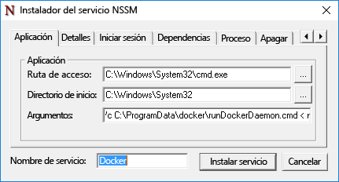
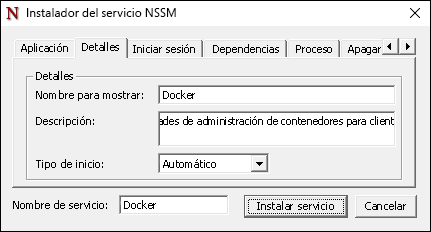
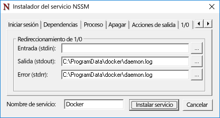

# Docker y Windows

**Esto es contenido preliminar y está sujeto a cambios.** 

El motor de Docker no se incluye con Windows y deberá instalarse y configurarse por separado. Los pasos que se usan para ejecutar el motor de Docker en Windows son diferentes de los usados para ejecutarlo en Linux. En este documento se describe paso a paso la instalación y la configuración del motor de Docker en Windows Server 2016, Nano Server y el cliente de Windows. Tenga en cuenta también que el motor de Docker y la interfaz de la línea de comandos se han dividido recientemente en dos archivos. En este documento se incluyen instrucciones para la instalación de ambos.

Para obtener más información sobre Docker y el conjunto de herramientas de Docker, visite [Docker.com](https://www.docker.com/). 

> Debe habilitar la característica de contenedores de Windows si quiere usar Docker para crear y administrar contenedores de Windows. Para obtener instrucciones sobre cómo habilitar esta característica, consulte la [Guía de implementación de hosts de contenedor](./docker_windows.md).

## Windows Server 2016

### Instalación del demonio de Docker <!--1-->

Descargue docker.exe de `https://aka.ms/tp5/dockerd` y colóquelo en el directorio System32 del host de contenedor.

```none
wget https://aka.ms/tp5/dockerd -OutFile $env:SystemRoot\system32\dockerd.exe
```

Cree un directorio denominado `c:\programdata\docker`. En este directorio, cree un archivo denominado `runDockerDaemon.cmd`.

```none
New-Item -ItemType File -Path C:\ProgramData\Docker\runDockerDaemon.cmd -Force
```

Copie el texto siguiente en el archivo `runDockerDaemon.cmd`.

```none
@echo off
set certs=%ProgramData%\docker\certs.d

if exist %ProgramData%\docker (goto :run)
mkdir %ProgramData%\docker

:run
if exist %certs%\server-cert.pem (if exist %ProgramData%\docker\tag.txt (goto :secure))

if not exist %systemroot%\system32\dockerd.exe (goto :legacy)

dockerd -H npipe:// 
goto :eof

:legacy
docker daemon -H npipe:// 
goto :eof

:secure
if not exist %systemroot%\system32\dockerd.exe (goto :legacysecure)
dockerd -H npipe:// -H 0.0.0.0:2376 --tlsverify --tlscacert=%certs%\ca.pem --tlscert=%certs%\server-cert.pem --tlskey=%certs%\server-key.pem
goto :eof

:legacysecure
docker daemon -H npipe:// -H 0.0.0.0:2376 --tlsverify --tlscacert=%certs%\ca.pem --tlscert=%certs%\server-cert.pem --tlskey=%certs%\server-key.pem
```
Descargue nssm.exe de [https://nssm.cc/release/nssm-2.24.zip](https://nssm.cc/release/nssm-2.24.zip).

```none
wget https://nssm.cc/release/nssm-2.24.zip -OutFile $env:ALLUSERSPROFILE\nssm.zip
```

Extraiga el paquete comprimido.

```none
Expand-Archive -Path $env:ALLUSERSPROFILE\nssm.zip $env:ALLUSERSPROFILE
```

Copie `nssm-2.24\win64\nssm.exe` en el directorio `c:\windows\system32`.

```none
Copy-Item $env:ALLUSERSPROFILE\nssm-2.24\win64\nssm.exe $env:SystemRoot\system32
```
Ejecute `nssm install` para configurar el servicio Docker.

```none
start-process nssm install
```

Escriba los siguientes datos en los campos correspondientes del instalador del servicio NSSM.

Pestaña Aplicación:

**Ruta de acceso:** C:\Windows\System32\cmd.exe

**Directorio de inicio:** C:\Windows\System32

**Argumentos:** /s /c C:\ProgramData\docker\runDockerDaemon.cmd < nul

**Nombre del servicio:** Docker



Pestaña Detalles:

**Nombre para mostrar:** Docker

**Descripción:** el demonio de Docker ofrece funciones de administración de contenedores para los clientes de Docker.



Pestaña E/S:

**Resultado (stdout):** C:\ProgramData\docker\daemon.log

**Error (stderr):** C:\ProgramData\docker\daemon.log



Cuando haya terminado, haga clic en el botón `Install Service`.

El demonio de Docker ya está configurado como un servicio de Windows.

### Firewall <!--1-->

Si quiere habilitar la administración remota de Docker, debe abrir también el puerto TCP 2376.

```none
netsh advfirewall firewall add rule name="Docker daemon " dir=in action=allow protocol=TCP localport=2376
```

### Quitar Docker <!--1-->

El comando siguiente quitará el servicio Docker.

```none
sc.exe delete Docker
```

### Instalación de la CLI de Docker

Descargue docker.exe de `https://aka.ms/tp5/docker` y colóquelo en el directorio System32 del host de contenedor o de cualquier otro sistema donde ejecutará comandos de Docker.

```none
wget https://aka.ms/tp5/docker -OutFile $env:SystemRoot\system32\docker.exe
```

## Nano Server

### Instalar Docker <!--2-->

Descargue dockerd.exe de `https://aka.ms/tp5/dockerd` y cópielo en la carpeta `windows\system32` del host de contenedor de Nano Server.

Cree un directorio denominado `c:\programdata\docker`. En este directorio, cree un archivo denominado `runDockerDaemon.cmd`.

```none
New-Item -ItemType File -Path C:\ProgramData\Docker\runDockerDaemon.cmd -Force
```

Copie el texto siguiente en el archivo `runDockerDaemon.cmd`.

```none
@echo off
set certs=%ProgramData%\docker\certs.d

if exist %ProgramData%\docker (goto :run)
mkdir %ProgramData%\docker

:run
if exist %certs%\server-cert.pem (if exist %ProgramData%\docker\tag.txt (goto :secure))

if not exist %systemroot%\system32\dockerd.exe (goto :legacy)

dockerd -H npipe:// 
goto :eof

:legacy
docker daemon -H npipe:// 
goto :eof

:secure
if not exist %systemroot%\system32\dockerd.exe (goto :legacysecure)
dockerd -H npipe:// -H 0.0.0.0:2376 --tlsverify --tlscacert=%certs%\ca.pem --tlscert=%certs%\server-cert.pem --tlskey=%certs%\server-key.pem
goto :eof

:legacysecure
docker daemon -H npipe:// -H 0.0.0.0:2376 --tlsverify --tlscacert=%certs%\ca.pem --tlscert=%certs%\server-cert.pem --tlskey=%certs%\server-key.pem
```

Puede usar el script siguiente para crear una tarea programada que inicie el demonio de Docker cuando Windows arranque.

```none
# Creates a scheduled task to start docker.exe at computer start up.

$dockerData = "$($env:ProgramData)\docker"
$dockerDaemonScript = "$dockerData\runDockerDaemon.cmd"
$dockerLog = "$dockerData\daemon.log"
$action = New-ScheduledTaskAction -Execute "cmd.exe" -Argument "/c $dockerDaemonScript > $dockerLog 2>&1" -WorkingDirectory $dockerData
$trigger = New-ScheduledTaskTrigger -AtStartup
$settings = New-ScheduledTaskSettingsSet -Priority 5
Register-ScheduledTask -TaskName Docker -Action $action -Trigger $trigger -Settings $settings -User SYSTEM -RunLevel Highest | Out-Null
Start-ScheduledTask -TaskName Docker 
```

### Firewall <!--2-->

Si quiere habilitar la administración remota de Docker, debe abrir también el puerto TCP 2376.

```none
netsh advfirewall firewall add rule name="Docker daemon " dir=in action=allow protocol=TCP localport=2376
```

### Sesión interactiva de Nano

Nano Server se administra a través de una sesión remota de PowerShell. Para obtener información sobre cómo administrar Nano Server de forma remota, consulte [Getting Started with Nano Server]( https://technet.microsoft.com/en-us/library/mt126167.aspx#bkmk_ManageRemote) (Introducción a Nano Server).

No todas las operaciones docker, como "docker attach", se puede realizar a través de esta sesión remota de PowerShell. Para solucionar este problema, y como procedimiento recomendado en general, administre Docker desde un cliente remoto a través de una conexión TCP segura.

Para ello, asegúrese de que el demonio de Docker se haya configurado para que escuche en un puerto TCP y que la interfaz de la línea de comandos de Docker esté disponible en un equipo cliente remoto. Cuando esté configurado, pueden emitirse comandos docker para el host con el parámetro -H. Para obtener más información sobre cómo acceder al demonio de Docker desde un sistema remoto, consulte [Daemon socket options (Opciones de socket de demonio) en Docker.com](https://docs.docker.com/engine/reference/commandline/daemon/#daemon-socket-option).

Para implementar remotamente un contenedor e iniciar una sesión interactiva, ejecute el siguiente comando.

```none
docker -H tcp://<ipaddress of server>:2376 run -it nanoserver cmd
```

Puede crear una variable de entorno DOCKER_HOST que eliminará el requisito del parámetro -H. Para ello, puede usar el siguiente comando de PowerShell.

```none
$env:DOCKER_HOST = "tcp://<ipaddress of server:2376"
```

Una vez que haya establecido esta variable, el comando tendrá el aspecto siguiente.

```none
docker run -it nanoserver cmd
```

### Quitar Docker <!--2-->

Para quitar el demonio de Docker y la CLI de Nano Server, elimine `docker.exe` del directorio Windows\system32.

```none
Remove-Item $env:SystemRoot\system32\docker.exe
``` 

Ejecute lo siguiente para anular el registro de la tarea programada de Docker.

```none
Get-ScheduledTask -TaskName Docker | UnRegister-ScheduledTask
```

### Instalación de la CLI de Docker

Descargue docker.exe de `https://aka.ms/tp5/docker` y cópielo en la carpeta windows\system32 del host de contenedor de Nano Server.

```none
wget https://aka.ms/tp5/docker -OutFile $env:SystemRoot\system32\docker.exe
```

## Configuración del inicio de Docker

Existen varias opciones de inicio para el demonio de Docker. En esta sección se describen las opciones pertinentes para el demonio de Docker en Windows. Para conocer todas las opciones del demonio, consulte la [documentación del demonio de Docker en docker.com]( https://docs.docker.com/engine/reference/commandline/daemon/).

### Puerto TCP de escucha

El demonio de Docker puede configurarse para que escuche las conexiones entrantes localmente a través de una canalización con nombre o remotamente a través de una conexión TCP. El comportamiento de inicio predeterminado consiste en que escuche solo en la canalización con nombre, lo que impide las conexiones remotas.

```none
docker daemon -D
```

Es posible modificarlo para que escuche las conexiones entrantes seguras con el siguiente comando de inicio. Para obtener más información sobre cómo proteger la conexión, consulte la [documentación sobre la configuración de seguridad en docker.com](https://docs.docker.com/engine/security/https/).

```none
docker daemon -D -H npipe:// -H tcp://0.0.0.0:2376 --tlsverify --tlscacert=%certs%\ca.pem --tlscert=%certs%\server-cert.pem --tlskey=%certs%\server-key.pem
``` 

### Acceso a canalización con nombre

Los comandos docker que se ejecutan localmente en el host de contenedor se reciben a través de una canalización con nombre. Para ejecutar estos comandos, se necesita acceso administrativo. Otra opción consiste en especificar un grupo que tendrá acceso a la canalización con nombre. En el ejemplo siguiente, se le proporciona acceso a un grupo de Windows denominado `docker`.

```none
dockerd -H npipe:// -G docker
```  


### Tiempo de ejecución predeterminado

Los contenedores de Windows tienen dos tipos de tiempo de ejecución distintos: Hyper-V y Windows Server. El demonio de Docker está configurado para usar de forma predeterminada el tiempo de ejecución de Windows Server, pero esto puede cambiarse. Para establecer el tiempo de ejecución de Hyper-V como valor predeterminado, especifique "—exec-opt isolation=hyperv" al inicializar el demonio de Docker.

```none
docker daemon -D —exec-opt isolation=hyperv
```


<!--HONumber=May16_HO5-->


