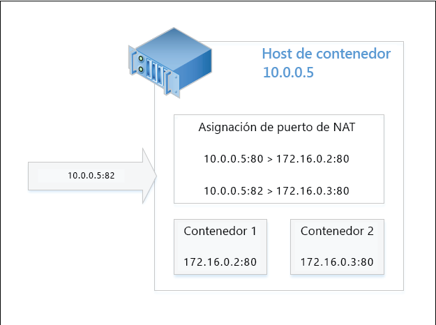
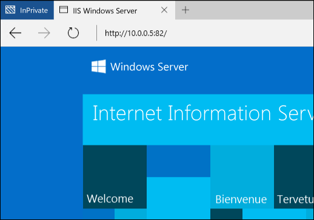

# Red de contenedores

**Esto es contenido preliminar y está sujeto a cambios.** 

Los contenedores de Windows funcionan de forma similar a las máquinas virtuales en lo que respecta a las redes. Cada contenedor tiene un adaptador de red virtual, que está conectado a un conmutador virtual, a través del cual se reenvía el tráfico entrante y saliente. Para aplicar el aislamiento entre contenedores del mismo host, se crea un compartimento de red para cada Windows Server y contenedor de Hyper-V en el que esté instalado el adaptador de red para el contenedor. Los contenedores de Windows Server usan una vNIC de host para conectarse al conmutador virtual. Los contenedores de Hyper-V usan una NIC de máquina virtual sintética (no expuesta a la máquina virtual de utilidad) para conectarse al conmutador virtual.

Los contenedores de Windows admiten cuatro modos de red diferentes.

- **Modo de traducción de direcciones de red**: cada contenedor está conectado a un conmutador virtual interno y usará WinNAT para conectarse a una subred de IP privada. WinNAT llevará a cabo la traducción de direcciones de red (NAT) y la traducción de direcciones de puerto (PAT) entre el host de contenedor y los propios contenedores.

- **Modo transparente**: cada contenedor está conectado a un conmutador virtual externo y se conectará directamente a la red física. Las direcciones IP se pueden asignar de manera estática o dinámica mediante un servidor DHCP externo. Las tramas de tráfico de red de contenedor sin formato se colocan directamente en la red física sin que se lleve a cabo una traducción de direcciones.

- **Modo puente de nivel 2**: cada contenedor está conectado a un conmutador virtual externo. El tráfico de red entre dos contenedores de la misma subred IP y conectados al mismo contenedor host se enlazarán con puente directamente. El tráfico de red entre dos contenedores en subredes IP distintas o conectados a contenedores host diferentes se enviarán a través del conmutador virtual externo. En la salida, la dirección MAC de origen del tráfico de red que se origina en el contenedor se reescribirá en la del host de contenedor. En la entrada, la dirección MAC de destino del tráfico de red destinado al contenedor se reescribirá en la del propio contenedor.

- **Modo de túnel de nivel 2** - *(este modo solo se debe usar en una pila en la nube de Microsoft)*. De forma similar al modo puente de nivel 2, cada contenedor está conectado a un conmutador virtual externo y las direcciones MAC se reescriben en la entrada y salida. En cambio, todo el tráfico de red del contenedor se reenvía al conmutador virtual del host físico independientemente de la conectividad de nivel 2. Esto permite que se aplique una directiva de red en el conmutador virtual del host físico, como programan los niveles más altos de la pila de red (por ejemplo, la controladora de red o el proveedor de recursos de red).

En este documento encontrará información detallada de los beneficios y la configuración de cada uno de estos tipos de configuración.

## Crear una red

### Información general

Puede usar PowerShell o Docker para crear redes de contenedor, conectar contenedores a una red y configurar reglas de reenvío de puerto. Más adelante, se hará hincapié en los comandos de red de Docker basados en el modelo de red en la nube (CNM) de Docker.

La lista de controladores aceptables para la creación de redes en Docker son "transparent", "nat" y "l2bridge". Como se indicó anteriormente, el controlador de túnel de nivel 2 solo debe usarse en escenarios de implementación de nube pública de Microsoft Azure. 

> Los controladores de red de Docker usan solo letras minúsculas.

El demonio de Docker hace referencia a los diferentes modos de red por el nombre del controlador usado para crear la red. Por ejemplo, el modo de red NAT tiene un controlador de red de Docker correspondiente denominado nat. De forma predeterminada, el motor de Docker en Windows buscará una red con un controlador de nat. Si no existe una red NAT, el motor de Docker creará una. Todos los contenedores creados se asociarán a la red nat de forma predeterminada.

Este comportamiento (que usa de forma predeterminada un controlador de red NAT) puede reemplazarse especificando un puente concreto denominado "none" mediante la opción -b "none" al iniciar el motor de demonio de Docker.

Para detener el servicio, use el comando de PowerShell siguiente.

```none
Stop-Service docker
```

El archivo de configuración se encuentra en `c:\programdata\docker\runDockerDaemon.cmd`. Edite la línea siguiente y agregue `-b "none"`

```none
dockerd <options> -b “none”
```

Reinicie el servicio.

```none
Start-Service docker
```

Cuando el demonio de Docker se ejecuta con -b "none", debe crearse una red específica y hacerse referencia a ella durante la creación o el inicio del contenedor.

Para enumerar las redes de contenedor disponibles en el host, use los siguientes comandos de Docker o PowerShell.

```none
docker network ls
```
La salida se parecerá a lo siguiente:

```none
NETWORK ID          NAME                DRIVER
bd8b691a8286        nat                 nat
7b055c7ed373        none                null
```
O bien, el equivalente de PowerShell:


```none
Get-ContainerNetwork |fl
```

La salida se parecerá a lo siguiente:

```none
Name               : nat
SubnetPrefix       : {172.16.0.0/12}
Gateways           : {172.16.0.1}
Id                 : 67ea1851-326d-408b-a5ef-7dcdb15c4438
Mode               : NAT
NetworkAdapterName :
SourceMac          :
DNSServers         : {10.222.118.22, 10.221.228.12, 10.222.114.67}
DNSSuffix          : corp.microsoft.com
IsDeleted          : False
```

> En PowerShell, los nombres del modo de red no distinguen mayúsculas de minúsculas.


### Red NAT

**Traducción de direcciones de red**: este modo de red es útil para asignar rápidamente direcciones IP privadas a un contenedor. El acceso externo al contenedor se proporciona mediante la asignación de un puerto entre la dirección IP externa y el puerto (host de contenedor) y la dirección IP interna y el puerto del contenedor. Todo el tráfico de red recibido en la combinación de dirección IP externa y puerto se compara con una tabla de asignación de puertos WinNAT y se reenvía a la dirección IP y el puerto del contenedor correcto. Además, NAT permite que varios contenedores hospeden aplicaciones que requieran puertos de comunicación (interna) idénticos asignándolos a puertos externos únicos. Windows solo admite la existencia de un prefijo interno de red NAT por host. Para más información, lea la entrada de blog [Capacidades y limitaciones de WinNAT](https://blogs.technet.microsoft.com/virtualization/2016/05/25/windows-nat-winnat-capabilities-and-limitations/). 

> Desde TP5, se creará automáticamente una regla de firewall para todas las asignaciones de puertos estáticos NAT. Esta regla de firewall será global para el host de contenedor y no estará localizada en un adaptador de red o punto de conexión de contenedor específico.

#### Configuración del host <!--1-->

Para usar el modo de red NAT, cree una red de contenedor con el nombre de controlador "nat". 

> Como solo se puede crear una red _nat_ predeterminada por host, asegúrese de que solo crea una nueva red NAT cuando todas las demás redes NAT se hayan quitado y el demonio de Docker se ejecute con la opción '-b "none"'. O bien, si simplemente quiere controlar qué red IP interna usa NAT, puede agregar la opción _--fixed-cidr=<máscara/prefijo interno NAT>_ del comando dockerd en C:\ProgramData\docker\runDockerDaemon.cmd.

```none
docker network create -d nat MyNatNetwork [--subnet=<string[]>] [--gateway=<string[]>]
```

Para crear una red NAT con PowerShell, use la sintaxis siguiente. Tenga en cuenta que se pueden especificar parámetros adicionales mediante PowerShell, incluidos DNSServers y DNSSuffix. Si no se especifican, estos valores de configuración se heredan del host de contenedor.

```none
New-ContainerNetwork -Name MyNatNetwork -Mode NAT -SubnetPrefix "172.16.0.0/12" [-GatewayAddress <address>] [-DNSServers <address>] [-DNSSuffix <string>]
```

> Hay un problema conocido en Windows Server 2016 Technical Preview 5 y en las compilaciones recientes no finales de Windows Insider Preview (WIP) donde, después de la actualización a una nueva compilación da como resultado una red de contenedor duplicada (es decir, "perdida") y un conmutador virtual. Para solucionar este problema, ejecute el script siguiente.
```none
PS> $KeyPath = "HKLM:\SYSTEM\CurrentControlSet\Services\vmsmp\parameters\SwitchList"
PS> $keys = get-childitem $KeyPath
PS> foreach($key in $keys)
PS> {
PS>    if ($key.GetValue("FriendlyName") -eq 'nat')
PS>    {
PS>       $newKeyPath = $KeyPath+"\"+$key.PSChildName
PS>       Remove-Item -Path $newKeyPath -Recurse
PS>    }
PS> }
PS> remove-netnat -Confirm:$false
PS> Get-ContainerNetwork | Remove-ContainerNetwork
PS> Get-VmSwitch -Name nat | Remove-VmSwitch (_failure is expected_)
PS> Stop-Service docker
PS> Set-Service docker -StartupType Disabled
Reboot Host
PS> Get-NetNat | Remove-NetNat
PS> Set-Service docker -StartupType automatic
PS> Start-Service docker 
```

### Red transparente

**Red transparente**: este modo de red solo debe usarse en implementaciones muy pequeñas en las que se requiere una conectividad directa entre los contenedores y la red física. En esta configuración, todos los servicios de red que se ejecutan en un contenedor serán accesibles directamente desde la red física. Las direcciones IP se pueden asignar estáticamente, suponiendo que se encuentran dentro del prefijo de subred IP de la red física y que no entran en conflicto con otras direcciones IP de la red física. Las direcciones IP también se pueden asignar dinámicamente desde un servidor DHCP externo de la red física. Si no se usa DHCP para la asignación de direcciones IP, puede especificarse una dirección IP de puerta de enlace. 

#### Configuración del host <!--2-->

Para usar el modo de red transparente, cree una red de contenedor con el nombre de controlador "transparent". 

```none
docker network create -d transparent MyTransparentNetwork
```

En este ejemplo se crea una red transparente y se le asigna una puerta de enlace.

```none
docker network create -d transparent --gateway=10.50.34.1 "MyTransparentNet"
```

Si el host de contenedor está virtualizado y quiere usar DHCP para la asignación de direcciones IP, debe habilitar MACAddressSpoofing en el adaptador de red de las máquinas virtuales.

```none
Get-VMNetworkAdapter -VMName ContainerHostVM | Set-VMNetworkAdapter -MacAddressSpoofing On
```

> Si quiere crear más de una red transparente (o puente de nivel 2), debe especificar a qué adaptador de red (virtual) se debe enlazar el conmutador virtual externo de Hyper-V (creado automáticamente).
 
### Redes de puente de nivel 2

**Redes de puente de nivel 2**: en esta configuración, la extensión vSwitch de la plataforma de filtrado virtual (VFP) del host de contenedor actuará como puente y realizará la traducción de direcciones de nivel 2 (reescritura de dirección MAC) según sea necesario. Las direcciones IP de nivel 3 y los puertos de nivel 4 no cambiarán. Las direcciones IP se pueden asignar estáticamente para que coincidan con el prefijo de subred IP de la red física o, si se usa una implementación de nube privada de Microsoft, con una dirección IP del prefijo de subred de la red virtual.

#### Configuración del host <!--3-->

Para usar el modo de redes de puente de nivel 2, cree una red de contenedor con el nombre de controlador "l2bridge". Cuando se crea una red de puente de nivel 2, también deben especificarse una subred y una puerta de enlace.

```none
docker network create -d l2bridge --subnet=192.168.1.0/24 --gateway=192.168.1.1 MyBridgeNetwork
```

## Quitar una red

Use `docker network rm` para eliminar una red de contenedor.

```none
docker network rm "<network name>"
```
O bien, `Remove-ContainerNetwork` con PowerShell:

De este modo se limpian los conmutadores virtuales de Hyper-V que haya usado la red de contenedor, así como los objetos de traducción de direcciones de red creados para las redes de contenedor nat.

## Opciones de red

Pueden especificarse diferentes opciones de red de Docker cuando se crea la red de contenedor o el propio contenedor. Además de la opción -d (--driver=<network mode>) para especificar el modo de red, también se admiten las opciones --gateway, --subnet y -o cuando se crea una red de contenedor.

### Opciones adicionales

La dirección IP de puerta de enlace puede especificarse mediante `--gateway`. Esto debe realizarse solo cuando se use una asignación de IP asignada estáticamente (redes transparentes).

```none
docker network create -d transparent --gateway=10.50.34.1 "MyTransparentNet"
```

Puede especificarse un prefijo de subred IP mediante `--subnet`, lo que controlará el segmento de red desde el que se asignarán las direcciones IP.

```none
docker network create -d nat --subnet=192.168.0.0/24 "MyCustomNatNetwork"
```
Pueden realizarse personalizaciones adicionales en una red de contenedor a través de Docker mediante el parámetro -o (--opt=map[]). 

Para especificar qué adaptador de red del host de contenedor se usará para una red transparente, de puente de nivel 2 o de túnel de nivel 2, especifique la opción *com.docker.network.windowsshim.interface*. 
```none
docker network create -d transparent -o com.docker.network.windowsshim.interface="Ethernet 2" "TransparentNetTwo"
```

El valor de *com.docker.network.windowsshim.interface* es el *nombre* del adaptador de: 
```none
Get-NetAdapter
```

> Las redes de contenedor creadas a través de PowerShell no estarán disponibles en Docker hasta que se reinicie el demonio de Docker. Los demás cambios realizados en una red de contenedor a través de PowerShell también requieren el reinicio del demonio de Docker.

### Varias redes de contenedor

Pueden crearse varias redes de contenedor en un host de contenedor único, pero deben tenerse en cuenta las advertencias siguientes:
* Solo se puede crear una red NAT por host contenedor.
* Las redes que usen un vSwitch externo para conectividad (por ejemplo, transparente, puente de nivel 2, transparente de nivel 2) deben usar su propio adaptador de red.

### Selección de red

Al crear un contenedor de Windows, puede especificarse una red a la que se conectará el adaptador de red del contenedor. Si no se especifica ninguna red, se usará la red NAT predeterminada.

Para conectar un contenedor a una red NAT que no sea la predeterminada (o cuando se use -b "none"), use la red opción --net con el comando run de Docker.

```none
docker run -it --net=MyTransparentNet windowsservercore cmd
```

### Dirección IP estática

Las direcciones IP estáticas se establecen en el adaptador de red del contenedor y solo se admiten para los modos de red NAT, transparente ([PR](https://github.com/docker/docker/pull/22208) pendiente) y puente de nivel 2. Además, no se admite la asignación de dirección IP estática para la red "nat" predeterminada a través de Docker.

```none
docker run -it --net=MyTransparentNet --ip=10.80.123.32 windowsservercore cmd
```

La asignación de dirección IP estática se lleva a cabo directamente en el adaptador de red del contenedor y solo debe realizarse cuando el contenedor se encuentre en estado detenido. No se admite el "agregado en caliente" de los adaptadores de red de contenedor ni los cambios en la pila de red mientras se esté ejecutando el contenedor.

```none
Get-ContainerNetworkAdapter -ContainerName "DemoNAT"

ContainerName Name            Network Id                           Static MacAddress Static IPAddress Maximum Bandwidth
------------- ----            ----------                           ----------------- ---------------- -----------------
DemoNAT       Network Adapter C475D31C-FB42-408E-8493-6DB6C9586915                              0

Set-ContainerNetworkAdapter -ContainerName "DemoNAT" -StaticIPAddress 172.16.0.100
```

Si prefiere que la dirección IP se elija automáticamente del intervalo especificado en el prefijo de subred de la red de contenedor, inicie el contenedor sin aplicar ninguna configuración al adaptador de red del contenedor.

> La asignación de direcciones IP estáticas a través de PowerShell no funcionará en los puntos de conexión del contenedor conectados a una red transparente.

Para ver qué contenedores están conectados a una red específica y las direcciones IP asociadas con estos puntos de conexión del contenedor, puede ejecutar lo siguiente.

```none
docker network inspect nat
```

### Crear una dirección MAC

Puede especificarse una dirección MAC mediante la opción `--mac-address`.

```none
docker run -it --mac="92:d0:c6:0a:29:33" --name="MyContainer" windowsservercore cmd
```

### Asignación de puertos

Para tener acceso a las aplicaciones dentro de un contenedor conectado a una red NAT, deben crearse asignaciones de puertos entre el host de contenedor y el adaptador de red del contenedor. Estas asignaciones deben crearse mientras el contenedor se encuentre en estado detenido.

En este ejemplo se crea una asignación estática entre el puerto **80** del host de contenedor y el puerto **80** del contenedor.

```none
docker run -it --name=DemoNat -p 80:80 windowsservercore cmd
```

En este ejemplo se crea una asignación estática entre el puerto **8082** del host de contenedor y el puerto **80** del contenedor.

```none
docker run -it --name=DemoNat -p 8082:80 windowsservercore cmd
```

También se admiten a través de Docker las asignaciones de puertos dinámicos, de modo que el usuario no tenga que especificar un puerto concreto para asignarlo desde el host de contenedor. Se seleccionará un puerto efímero aleatorio en el host de contenedor, que se puede inspeccionar al ejecutar Docker ps.

```none
docker run -itd --name=DemoNat -p 80 windowsservercore cmd

docker ps
CONTAINER ID        IMAGE               COMMAND             CREATED             STATUS              PORTS                   NAMES
bbf72109b1fc        windowsservercore   "cmd"               6 seconds ago       Up 2 seconds        *0.0.0.0:14824->80/tcp*   DemoNat
```

En este ejemplo, el puerto TCP 80 del contenedor DemoNat se expone externamente desde el host de contenedor en el puerto 14824.

Una vez creada la asignación de puertos, se puede obtener acceso a una aplicación del contenedor a través de la dirección IP del host de contenedor (física o virtual) y del puerto externo expuesto. Por ejemplo, el diagrama siguiente representa una configuración de NAT con una solicitud dirigida al puerto externo **82** del host de contenedor. Según la asignación de puertos, esta solicitud devolvería la aplicación hospedada en el contenedor 2.



Una vista de la solicitud de un explorador de Internet.



## Advertencias y problemas comunes

### Firewall

El host de contenedor requiere la creación de reglas de firewall específicas para habilitar ICMP (Ping) y DHCP. Los contenedores de Windows Server requieren que ICMP y DHCP hagan ping entre dos contenedores del mismo host y que reciban direcciones IP asignadas dinámicamente mediante DHCP. En TP5, estas reglas se crearán mediante el script Install-ContainerHost.ps1. En versiones posteriores a TP5, estas reglas se crearán automáticamente. Todas las reglas de firewall correspondientes a las reglas de reenvío de puerto NAT se crean automáticamente y se limpian cuando se detiene el contenedor.

### Características no admitidas

En la actualidad no se admiten las siguientes características de red a través de la CLI de Docker:
 * vinculación de contenedores (por ejemplo, --link)
 * resolución de IP basada en nombres para los contenedores

En este momento, no se admiten en Windows Docker las siguientes opciones de red:
 * --add-host
 * --dns
 * --dns-opt
 * --dns-search
 * -h, --hostname
 * --net-alias
 * --aux-address
 * --internal
 * --ip-range


<!--HONumber=Jul16_HO5-->


