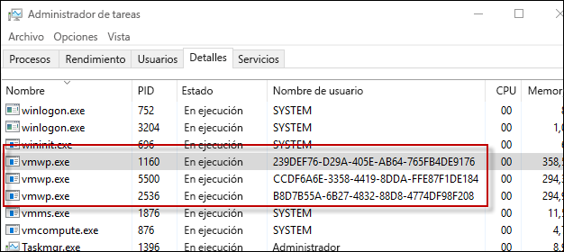

# Contenedores de Hyper-V

**Esto es contenido preliminar y está sujeto a cambios.**

La tecnología de contenedor de Windows incluye dos tipos distintos de contenedores, contenedores de Windows Server y de Hyper-V. Los dos tipos de contenedores se crean, se administran y funcionan de forma idéntica. La diferencia entre ellos es el nivel de aislamiento entre el contenedor, el sistema operativo host y todo lo que incluye el otro contenedor que se ejecuta en ese host.

**Contenedores de Windows Server**: varios contenedores que se ejecutan en un host con aislamiento que se ofrece a través de tecnologías de aislamiento de proceso y espacio de nombres.

**Contenedores de Hyper-V**: varios contenedores se ejecutan en un host, pero cada contenedor se ejecuta dentro de una máquina virtual de utilidad. Esto ofrece aislamiento a nivel de kernel entre un contenedor de Hyper-V, el host de contenedor y los demás contenedores que se ejecutan en el host de contenedor.

## PowerShell de contenedor de Hyper-V

### Crear contenedor

Un contenedor de Hyper-V se crea de forma idéntica a un contenedor de Windows Server, con la única diferencia de un parámetro de tiempo de ejecución que indica que será un contenedor de Hyper-V.

Ejemplo de creación de un contenedor de Hyper-V con PowerShell

```powershell
PS C:\> $con = New-Container -Name HYPVCON -ContainerImageName NanoServer -SwitchName "Virtual Switch" -RuntimeType HyperV
```

### Convertir el contenedor

Además de crear un contenedor como un contenedor de Hyper-V en tiempo de compilación, los contenedores que se han creado con PowerShell también se pueden convertir de un contenedor de Windows Server a un contenedor de Hyper-V.

> Actualmente, el único sistema operativo de host que admite la conversión en tiempo de ejecución del contenedor es Nano Server.

Cree un nuevo contenedor con el tiempo de ejecución predeterminado.

```powershell
PS C:\> New-Container -Name DEMO -ContainerImageName nanoserver -SwitchName NAT
```
Devuelva la propiedad de tiempo de ejecución del contenedor, observe que el tiempo de ejecución está establecido como valor predeterminado.

```powershell
PS C:\> Get-Container | Select ContainerName, RuntimeType

ContainerName RuntimeType
------------- -----------
DEMO              Default
```

Use el comando `set-container` para cambiar el tiempo de ejecución del contenedor.

```powershell
PS C:\> Set-Container $con -RuntimeType HyperV
```

Por último, devuelva la propiedad de tiempo de ejecución una vez más para ver el cambio.

```powershell
PS C:\> Get-Container | select ContainerName, RuntimeType

ContainerName RuntimeType
------------- -----------
DEMO               HyperV
```

## Docker de contenedor de Hyper-V

### Crear contenedor

La administración de contenedores de Hyper-V con Docker es casi idéntica a la administración de contenedores de Windows Server. Al crear un contenedor de Hyper-V con Docker, se usa el parámetro `–issolation=hyperv`.

```powershell
docker run -it --isolation=hyperv 646d6317b02f cmd
```

## Elementos internos

### Procesos de trabajo de la máquina virtual

Por cada contenedor de Hyper-V que se crea, se creará un proceso de trabajo de máquina virtual correspondiente.

```powershell
PS C:\> Get-Container | Select Name, RuntimeType, ContainerID | Where {$_.RuntimeType -eq 'Hyperv'}

Name RuntimeType ContainerId
---- ----------- -----------
TST3      HyperV 239def76-d29a-405e-ab64-765fb4de9176
TST       HyperV b8d7b55a-6b27-4832-88d8-4774df98f208
TST2      HyperV ccdf6a6e-3358-4419-8dda-ffe87f1de184
```

Tenga en cuenta que el contenedor puede hacerse coincidir con un proceso según el identificador de contenedor y el nombre de usuario del proceso.



Esta relación también se puede ver con el comando `Get-ComputeProcess`.

```powershell
PS C:\> Get-ComputeProcess

Id                                   Name Owner      Type
--                                   ---- -----      ----
239DEF76-D29A-405E-AB64-765FB4DE9176 TST3 VMMS  Container
B8D7B55A-6B27-4832-88D8-4774DF98F208 TST  VMMS  Container
CCDF6A6E-3358-4419-8DDA-FFE87F1DE184 TST2 VMMS  Container
```

Para obtener más información sobre el comando `Get-ComputeProcess`, consulte [Interoperabilidad de administración](./hcs_powershell.md).

## Demostración de aislamiento

### Contenedor de Windows Server

El siguiente ejercicio se puede usar para mostrar el aislamiento de un contenedor de Hyper-V. En este ejercicio se crearán un contenedor de Hyper-V y uno de Windows Server. El proceso en ejecución en el host del contenedor se examinará y mostrará cómo se comparte el proceso del contenedor de Windows Server en el host de contenedor; sin embargo, el proceso de contenedores de Hyper-V no se comparte.

```powershell
PS C:\> get-process | where {$_.ProcessName -eq 'csrss'}

Handles  NPM(K)    PM(K)      WS(K) VM(M)   CPU(s)     Id  SI ProcessName
-------  ------    -----      ----- -----   ------     --  -- -----------
    255      12     1820       4000 ...98     0.53    532   0 csrss
    116      11     1284       3700 ...94     0.25    608   1 csrss
    246      13     1844       5504 ...17     3.45   3484   2 csrss
```

Crear nuevo contenedor de Windows Server:

```powershell
PS C:\> New-Container -Name WINCONT -ContainerImageName WindowsServerCore -SwitchName "Virtual Switch"
```

Inicie el contenedor.

```powershell
PS C:\> Start-Container $con
```

Crear una sesión remota de PS con el contenedor.

```powershell
PS C:\> Enter-PSSession -ContainerId $con.ContainerId –RunAsAdministrator
```

Desde la sesión remota del contenedor, devuelva todos los procesos con un nombre de proceso de csrss. Anote el identificador de proceso del proceso csrss en ejecución (1228 en el ejemplo siguiente).

```powershell
[WINCONT]: PS C:\> get-process | where {$_.ProcessName -eq 'csrss'}

Handles  NPM(K)    PM(K)      WS(K) VM(M)   CPU(s)     Id  SI ProcessName
-------  ------    -----      ----- -----   ------     --  -- -----------
    167       9     1276       3720 ...97     0.20   1228   3 csrss
```

Ahora devuelva la lista de procesos csrss del host del contenedor. Observe que el mismo proceso csrss también se devuelve desde el host del contenedor.

```powershell
PS C:\> get-process | where {$_.ProcessName -eq 'csrss'}

Handles  NPM(K)    PM(K)      WS(K) VM(M)   CPU(s)     Id  SI ProcessName
-------  ------    -----      ----- -----   ------     --  -- -----------
    252      11     1712       3968 ...98     0.53    532   0 csrss
    113      11     1176       3676 ...93     0.25    608   1 csrss
    175       9     1260       3708 ...97     0.20   1228   3 csrss
    243      13     1736       5512 ...17     3.77   3484   2 csrss
```
### Contenedor de Hyper-V

Devuelva una lista de procesos csrss del host del contenedor.

```powershell
PS C:\> get-process | where {$_.ProcessName -eq 'csrss'}

Handles  NPM(K)    PM(K)      WS(K) VM(M)   CPU(s)     Id  SI ProcessName
-------  ------    -----      ----- -----   ------     --  -- -----------
    261      12     1820       4004 ...98     0.53    532   0 csrss
    116      11     1284       3704 ...94     0.25    608   1 csrss
    246      13     1844       5536 ...17     3.83   3484   2 csrss
```

Ahora, cree un contenedor de Hyper-V.

```powershell
PS C:\> $con = New-Container -Name HYPVCON -ContainerImageName NanoServer -SwitchName "Virtual Switch" -RuntimeType HyperV
```

Inicie el contenedor de Hyper-V

```powershell
PS C:\> Start-Container $con
```

Cree una sesión remota de PS con el contenedor de Hyper-V.

```powershell
PS C:\> Enter-PSSession -ContainerId $con.ContainerId –RunAsAdministrator
```

Devuelva una lista de procesos csrss que se ejecuten dentro del contenedor de Hyper-V. Anote el identificador de proceso del proceso csrss (956 en el ejemplo siguiente).

```powershell
[HYPVCON]: PS C:\> get-process | where {$_.ProcessName -eq 'csrss'}

Handles  NPM(K)    PM(K)      WS(K) VM(M)   CPU(s)     Id  SI ProcessName
-------  ------    -----      ----- -----   ------     --  -- -----------
              4      452       1520 ...63     0.06    956   1 csrss
```

Ahora devuelva una lista de procesos csrss en el host del contenedor. Tenga en cuenta que, al contrario que con el contenedor de Windows Server, donde el proceso csrss estaba visible tanto desde dentro del contenedor como desde el host de contenedor, el proceso del contenedor de Hyper-V solo es visible desde dentro del propio contenedor. Esto se debe a que un contenedor de Hyper-V se encapsula en una máquina virtual de utilidad y el proceso se aísla solo a esa máquina virtual de utilidad.

```powershell
PS C:\> get-process | where {$_.ProcessName -eq 'csrss'}

Handles  NPM(K)    PM(K)      WS(K) VM(M)   CPU(s)     Id  SI ProcessName
-------  ------    -----      ----- -----   ------     --  -- -----------
    255      12     1716       3972 ...98     0.56    532   0 csrss
    113      11     1176       3676 ...93     0.25    608   1 csrss
    243      13     1732       5512 ...18     4.23   3484   2 csrss
```


