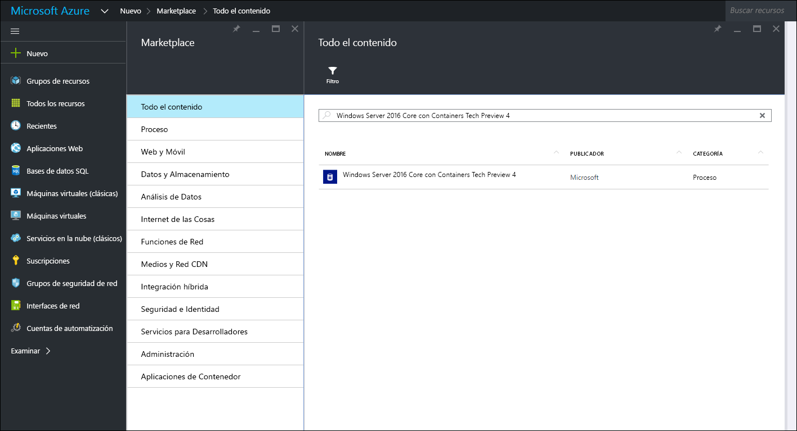
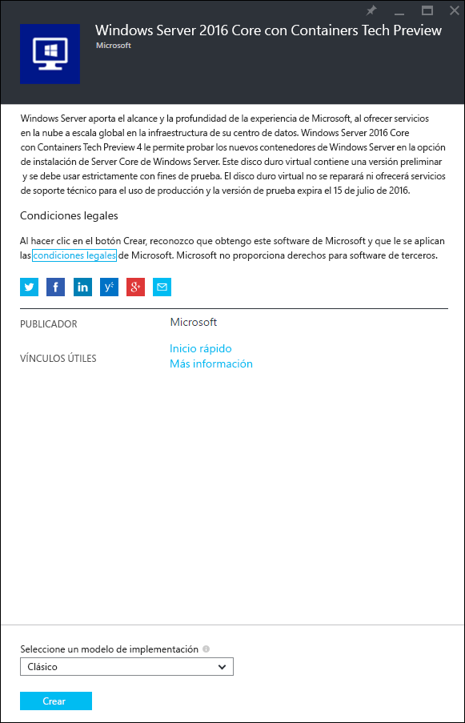
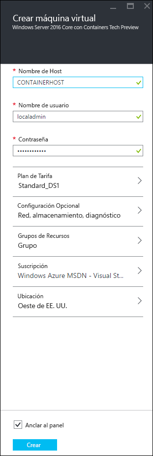
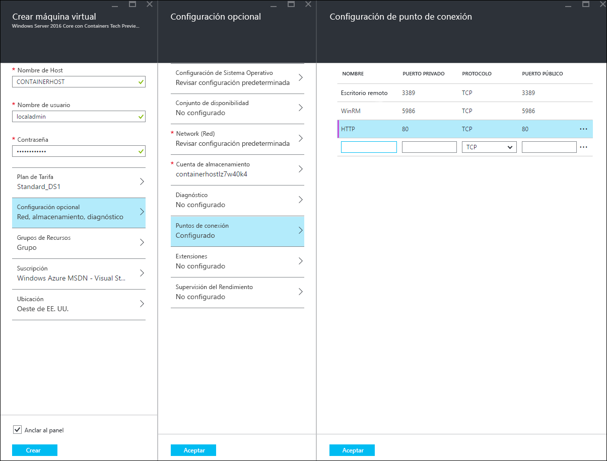
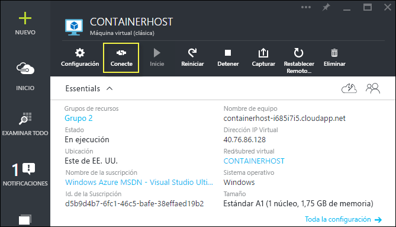
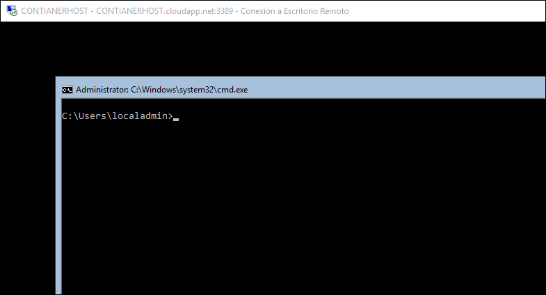

# Inicio rápido de Azure

Antes de crear y administrar contenedores de Windows Server en Azure, deberá implementar una imagen de Windows Server 2016 Technical Preview que se haya configurado previamente con la característica de contenedores de Windows Server. Esta guía le guiará a través de este proceso.

> Microsoft Azure no admite contenedores de Hyper-V. Para completar los ejercicios de contenedor de Hyper-V, necesita un host de contenedor local.

## Empezar a usar el Portal de Azure

Si tiene una cuenta de Azure, vaya directamente a [Crear una máquina virtual de host de contenedor](#CreateacontainerhostVM).

1. Vaya a [azure.com](https://azure.com) y siga los pasos para obtener una [prueba de evaluación gratuita](https://azure.microsoft.com/en-us/pricing/free-trial/).
2. Inicie sesión con su cuenta de Microsoft.
3. Cuando su cuenta esté lista, inicie sesión en el [Portal de administración de Azure](https://portal.azure.com).

## Crear una máquina virtual de host de contenedor

Busque en Azure Marketplace "containers", que devolverá "Windows Server 2016 Core with Containers Tech Preview 4"

Seleccione la imagen y haga clic en `crear`.

Asigne un nombre a la máquina virtual, seleccione un nombre de usuario y una contraseña.

Seleccione Configuración opcional > Puntos de conexión > y especifique un punto de conexión HTTP con un puerto público y privado de 80, tal y como se muestra a continuación. Cuando se complete, haga clic en Aceptar dos veces.

Seleccione el botón `crear` para iniciar el proceso de implementación de la máquina virtual.

Cuando se complete la implementación de la máquina virtual, seleccione el botón Conectar para iniciar una sesión RDP con el Host de contenedor de Windows Server.

Inicie sesión en la máquina virtual con el nombre de usuario y la contraseña especificados durante el Asistente para la creación de máquinas virtuales. Con la sesión iniciada, se encontrará con un símbolo del sistema de Windows.

## Tutorial en vídeo

<iframe src="https://channel9.msdn.com/Blogs/containers/Quick-Start-Configure-Windows-Server-Containers-in-Microsoft-Azure/player#ccLang=es" width="800" height="450"  allowFullScreen="true" frameBorder="0" scrolling="no"></iframe>

## Pasos siguientes: empezar a usar contenedores

Ahora que tiene un sistema de Windows Server 2016 ejecutando la característica de contenedor de Windows Server, continúe con las guías siguientes para empezar a trabajar con contenedores de Windows Server e imágenes de contenedores de Windows Server.

[Inicio rápido: contenedores de Windows y Docker](./manage_docker.md)  
[Inicio rápido: contenedores de Windows y PowerShell](./manage_powershell.md)

