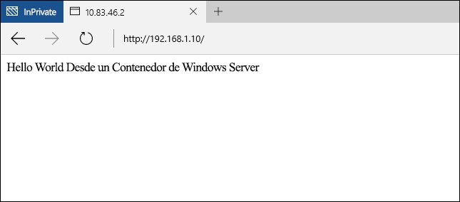

# Inicio rápido de contenedores de Windows: Docker

Los contenedores de Windows se pueden utilizar para implementar rápidamente varias aplicaciones aisladas en un único equipo. En este ejercicio se muestra la creación de contenedores de Windows y la administración con Docker. Cuando lo complete, debería tener un conocimiento básico de cómo se integra Docker con los contenedores de Windows y habrá obtenido experiencia práctica con la tecnología.

En este tutorial se detallarán los contenedores de Windows Server y Hyper-V. Cada tipo de contenedor tiene sus propios requisitos básicos. Con la documentación de contenedores de Windows se incluye un procedimiento para implementar rápidamente un host de contenedor. Se trata de la manera más fácil para empezar a trabajar rápidamente con contenedores de Windows. Si aún no dispone de un host de contenedor, consulte [Inicio rápido de implementación del host de contenedor](./container_setup.md).

Para cada uno de los ejercicios se requerirán los elementos siguientes.

**Contenedores de Windows Server:**

- Un host de contenedor de Windows que ejecute Windows Server 2016 (completo o Core), ya sea de forma local o en Azure.

**Contenedores de Hyper-V:**

- Un host de contenedor de Windows habilitado con virtualización anidada.
- Elementos multimedia de Windows Server 2016: [descargar](https://aka.ms/tp4/serveriso).

>Microsoft Azure no admite contenedores de Hyper-V. Para completar los ejercicios de contenedor de Hyper-V, necesita un host de contenedor local.

## Contenedor de Windows Server

Los contenedores de Windows Server ofrecen un entorno operativo aislado, portátil y controlado por recursos para ejecutar aplicaciones y procesos de hospedaje. Los contenedores de Windows Server ofrecen aislamiento entre el contenedor y el host, mediante el aislamiento del espacio de nombres y el proceso.

### Crear contenedor

Antes de crear un contenedor, use el comando `docker images` para enumerar las imágenes del contenedor instaladas en el host.

```powershell
PS C:\> docker images

REPOSITORY          TAG                 IMAGE ID            CREATED             VIRTUAL SIZE
windowsservercore   10.0.10586.0        6801d964fda5        2 weeks ago         0 B
windowsservercore   latest              6801d964fda5        2 weeks ago         0 B
nanoserver          10.0.10586.0        8572198a60f1        2 weeks ago         0 B
nanoserver          latest              8572198a60f1        2 weeks ago         0 B
```

En este ejemplo, cree un contenedor con la imagen de Windows Server Core. Esto se realiza con el comando `docker run`. Para más información sobre `docker run`, consulte la [referencia sobre Docker Run en docker.com](https://docs.docker.com/engine/reference/run/).

En este ejemplo se crea un contenedor denominado `iisbase` y se inicia una sesión interactiva con el contenedor.

```powershell
C:\> docker run --name iisbase -it windowsservercore cmd
```

Cuando se cree el contenedor, trabajará en una sesión de shell desde dentro del contenedor.


### Crear imagen de IIS

Se instalará IIS y después una imagen creada desde el contenedor. Para instalar IIS, ejecute lo siguiente.

```powershell
C:\> powershell.exe Install-WindowsFeature web-server
```

Cuando se complete, salga de la sesión de shell interactiva.

```powershell
C:\> exit
```

Por último, el contenedor se confirmará en una nueva imagen de contenedor mediante `docker commit`. En este ejemplo se crea una nueva imagen de contenedor con el nombre `windowsservercoreiis`.

```powershell
C:\> docker commit iisbase windowsservercoreiis
4193c9f34e320c4e2c52ec52550df225b2243927ed21f014fbfff3f29474b090
```

Las nuevas imágenes de IIS se pueden ver con el comando `docker images`.

```powershell
C:\> docker images

REPOSITORY             TAG                 IMAGE ID            CREATED             VIRTUAL SIZE
windowsservercoreiis   latest              4193c9f34e32        4 minutes ago       170.8 MB
windowsservercore      10.0.10586.0        6801d964fda5        2 weeks ago         0 B
windowsservercore      latest              6801d964fda5        2 weeks ago         0 B
nanoserver             10.0.10586.0        8572198a60f1        2 weeks ago         0 B
nanoserver             latest              8572198a60f1        2 weeks ago         0 B
```

### Configurar red

Antes de crear un contenedor con Docker, debe crear una regla para el Firewall de Windows que permitirá conectividad de red con el contenedor. Ejecute lo siguiente para crear una regla para el puerto 80.

```powershell
if (!(Get-NetFirewallRule | where {$_.Name -eq "TCP80"})) {
    New-NetFirewallRule -Name "TCP80" -DisplayName "HTTP on TCP/80" -Protocol tcp -LocalPort 80 -Action Allow -Enabled True
}
```

También puede tomar nota de la dirección IP del host de contenedor. Se usará durante todo el ejercicio.

### Crear contenedor de IIS

Ahora tiene una imagen de contenedor que contiene IIS, que se puede utilizar para implementar entornos operativos preparados para IIS.

Para crear un contenedor a partir de la nueva imagen, use el comando `docker run` especificando esta vez el nombre de la imagen de IIS. Observe que en este ejemplo se especifica un parámetro `-p 80:80`. Como el contenedor está conectado a un conmutador virtual que facilita la IP direcciones mediante traducción de direcciones de red, debe asignarse un puerto desde el host de contenedor a un puerto en las direcciones IP de NAT de los contenedores. Para más información sobre el parámetro `-p`, consulte la [referencia sobre Docker Run en docker.com](https://docs.docker.com/engine/reference/run/)

```powershell
C:\> docker run --name iisdemo -it -p 80:80 windowsservercoreiis cmd
```

Cuando se ha creado el contenedor, abra un explorador y vaya a la dirección IP del host del contenedor. Como el puerto 80 del host se ha asignado al puerto 80 del contenedor, se debe mostrar la pantalla de presentación de IIS.


### Crear aplicación

Ejecute el siguiente comando para quitar la pantalla de presentación de IIS.

```powershell
C:\> del C:\inetpub\wwwroot\iisstart.htm
```

Ejecute el comando siguiente para reemplazar el sitio de IIS predeterminado por un nuevo sitio estático.

```powershell
C:\> echo "Hello World From a Windows Server Container" > C:\inetpub\wwwroot\index.html
```

Explore de nuevo hasta la dirección IP del host de contenedor, ahora debería ver la aplicación "Hello World". Nota: Es posible que tenga que cerrar las conexiones del explorador existentes o borrar la memoria caché del explorador para ver la aplicación actualizada.



Salga de la sesión interactiva con el contenedor.

```powershell
C:\> exit
```

Quite el contenedor.

```powershell
C:\> docker rm iisdemo
```
Quite la imagen de IIS.

```powershell
C:\> docker rmi windowsservercoreiis
```

## Dockerfile

En el ejercicio anterior, se creó un contenedor de forma manual, se modificó y después se capturó en una nueva imagen de contenedor. Docker incluye un método para automatizar este proceso, mediante el uso de lo que se conoce como un archivo dockerfile. Este ejercicio tendrá resultados idénticos al anterior; sin embargo, esta vez el proceso estará completamente automatizado.

### Crear imagen de IIS

En el host de contenedor, cree un directorio `c:\build` y, en este directorio, cree un archivo denominado `dockerfile`.

```powershell
C:\> powershell new-item c:\build\dockerfile -Force
```

Abra el archivo dockerfile en el Bloc de notas.

```powershell
C:\> notepad c:\build\dockerfile
```

Copie el texto siguiente en el archivo dockerfile y guárdelo. Estos comandos indican a Docker que debe crear una nueva imagen con `windosservercore` como base, e incluir las modificaciones que se especifican con `RUN`. Para más información sobre archivos Dockerfile, consulte la [referencia sobre Dockerfile en docker.com](http://docs.docker.com/engine/reference/builder/).

```powershell
FROM windowsservercore
RUN dism /online /enable-feature /all /featurename:iis-webserver /NoRestart
RUN echo "Hello World - Dockerfile" > c:\inetpub\wwwroot\index.html
```

Este comando iniciará el proceso de compilación automatizada de imágenes. El parámetro `-t` indica al proceso que asigne un nombre a la nueva imagen `iis`.

```powershell
C:\> docker build -t iis c:\Build
```

Cuando complete este proceso, podrá comprobar que la imagen se creó mediante el comando `docker images`.

```powershell
C:\> docker images

REPOSITORY          TAG                 IMAGE ID            CREATED             VIRTUAL SIZE
iis                 latest              abb93867b6f4        26 seconds ago      209 MB
windowsservercore   10.0.10586.0        6801d964fda5        2 weeks ago         0 B
windowsservercore   latest              6801d964fda5        2 weeks ago         0 B
nanoserver          10.0.10586.0        8572198a60f1        2 weeks ago         0 B
nanoserver          latest              8572198a60f1        2 weeks ago         0 B
```

### Implementar contenedor de IIS

Ahora, como en el ejercicio anterior, implemente el contenedor, asignando el puerto 80 del host al puerto 80 del contenedor.

```powershell
C:\> docker run --name iisdemo -it -p 80:80 iis cmd
```

Una vez creado el contenedor, vaya a la dirección IP del host de contenedor. Debería ver la aplicación hello world.


Salga de la sesión interactiva con el contenedor.

```powershell
C:\> exit
```

Quite el contenedor.

```powershell
C:\> docker rm iisdemo
```
Quite la imagen de IIS.

```powershell
C:\> docker rmi iis
```

## Contenedor de Hyper-V

Los contenedores de Hyper-V ofrecen una capa de aislamiento adicional sobre los contenedores de Windows Server. Cada contenedor de Hyper-V se crea dentro de una máquina virtual altamente optimizada. Mientras que un contenedor de Windows Server comparte el kernel con el host de contenedor, un contenedor de Hyper-V está completamente aislado. Los contenedores de Hyper-V se crean y administran de forma idéntica a los contenedores de Windows Server. Para más información sobre los contenedores de Hyper-V, consulte [Administración de contenedores de Hyper-V](../management/hyperv_container.md).

>Microsoft Azure no admite contenedores de Hyper-V. Para completar los ejercicios de Hyper-V, necesita un host de contenedor local.

### Crear contenedor

Como el contenedor ejecutará una imagen de sistema operativo Nano Server, se necesitarán los paquetes de IIS de Nano Server para instalar IIS. Puede encontrarlos en los elementos multimedia de instalación de Windows Server 2016 TP4, en el directorio `NanoServer\Packages`.

En este ejemplo, puede hacer que un directorio del host de contenedor esté disponible para el contenedor en ejecución mediante el parámetro `-v` de `docker run`. Antes de hacerlo, deberá configurarse el directorio de origen.

Cree un directorio en el host de contenedor que se compartirá con el contenedor. Si ya ha completado el tutorial de PowerShell, es posible que este directorio y los archivos necesarios ya existan.

```powershell
C:\> powershell New-Item -Type Directory c:\share\en-us
```

Copie `Microsoft-NanoServer-IIS-Package.cab` de `NanoServer\Packages` a `c:\share` del host de contenedor.

Copie `NanoServer\Packages\en-us\Microsoft-NanoServer-IIS-Package.cab` en `c:\share\en-us` del host de contenedor.

Cree un archivo en la carpeta c:\share denominado unattend.xml y copie este texto en dicho archivo.

```powershell
<?xml version="1.0" encoding="utf-8"?>
<unattend xmlns="urn:schemas-microsoft-com:unattend">
    <servicing>
        <package action="install">
            <assemblyIdentity name="Microsoft-NanoServer-IIS-Package" version="10.0.10586.0" processorArchitecture="amd64" publicKeyToken="31bf3856ad364e35" language="neutral" />
            <source location="c:\iisinstall\Microsoft-NanoServer-IIS-Package.cab" />
        </package>
        <package action="install">
            <assemblyIdentity name="Microsoft-NanoServer-IIS-Package" version="10.0.10586.0" processorArchitecture="amd64" publicKeyToken="31bf3856ad364e35" language="en-US" />
            <source location="c:\iisinstall\en-us\Microsoft-NanoServer-IIS-Package.cab" />
        </package>
    </servicing>
</unattend>
```

Cuando se complete, el directorio `c:\share` del host de contenedor debería estar configurado de esta manera.

```
c:\share
|-- en-us
|    |-- Microsoft-NanoServer-IIS-Package.cab
|
|-- Microsoft-NanoServer-IIS-Package.cab
|-- unattend.xml
```

Para crear un contenedor de Hyper-V mediante docker, especifique el parámetro `--isolation=hyperv`. En este ejemplo, se monta el directorio `c:\share` del host en el directorio `c:\iisinstall` del contenedor para después crear una sesión de shell interactiva con el contenedor.

```powershell
C:\> docker run --name iisnanobase -it -v c:\share:c:\iisinstall --isolation=hyperv nanoserver cmd
```

### Crear imagen de IIS

Desde la misma sesión de shell del contenedor, puede instalar IIS con `dism`. Ejecute el comando siguiente para instalar IIS en el contenedor.

```powershell
C:\> dism /online /apply-unattend:c:\iisinstall\unattend.xml
```

Cuando se haya completado la instalación de IIS, inicie manualmente IIS con el siguiente comando.

```powershell
C:\> Net start w3svc
```

Salga de la sesión del contenedor.

```powershell
C:\> exit
```

### Crear contenedor de IIS

Ahora se puede confirmar el contenedor de Nano Server modificado en una nueva imagen de contenedor. Para ello, use el comando `docker commit`.

```powershell
C:\> docker commit iisnanobase nanoserveriis
```

Los resultados se pueden ver cuando se devuelve una lista de imágenes de contenedor.

```powershell
C:\> docker images

REPOSITORY          TAG                 IMAGE ID            CREATED              VIRTUAL SIZE
nanoserveriis       latest              444435a4e30f        About a minute ago   69.14 MB
windowsservercore   10.0.10586.0        6801d964fda5        2 weeks ago          0 B
windowsservercore   latest              6801d964fda5        2 weeks ago          0 B
nanoserver          10.0.10586.0        8572198a60f1        2 weeks ago          0 B
nanoserver          latest              8572198a60f1        2 weeks ago          0 B
```

### Crear aplicación

La imagen de IIS de Nano Server ahora se puede implementar en un nuevo contenedor.

```powershell
C:\> docker run -it -p 80:80 --isolation=hyperv nanoserveriis cmd
```

Ejecute el siguiente comando para quitar la pantalla de presentación de IIS.

```powershell
C:\> del C:\inetpub\wwwroot\iisstart.htm
```

Ejecute el comando siguiente para reemplazar el sitio de IIS predeterminado por un nuevo sitio estático.

```powershell
C:\> echo "Hello World From a Hyper-V Container" > C:\inetpub\wwwroot\index.html
```

Vaya a la dirección IP del host de contenedor, donde ahora debería ver la aplicación "Hello World". Nota: Es posible que tenga que cerrar las conexiones del explorador existentes o borrar la memoria caché del explorador para ver la aplicación actualizada.


Salga de la sesión interactiva con el contenedor.

```powershell
C:\> exit
```


<!--HONumber=Jan16_HO1-->
