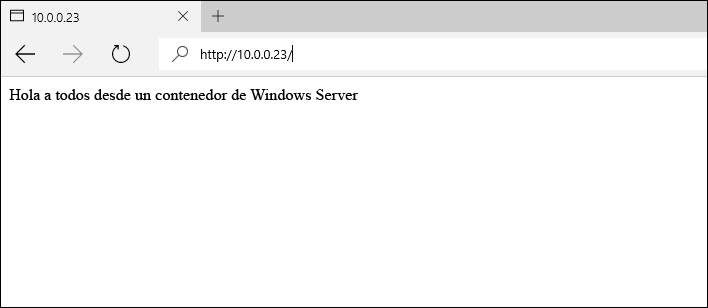
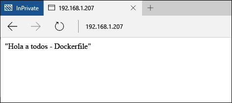

# Imágenes de contenedores en Windows Server

**Esto es contenido preliminar y está sujeto a cambios.** 

En el anterior inicio rápido de Windows Server se creó un contenedor de Windows a partir de una imagen de contenedor existente. Este ejercicio detallará la creación manual de imágenes de contenedor personalizadas y mediante un Dockerfile.

Este inicio rápido es específico de los contenedores de Windows Server en Windows Server 2016. En la tabla de contenido del lado izquierdo de esta página encontrará documentación adicional de inicio rápido. 

**Requisitos previos:**

- Un equipo (físico o virtual) con [Windows Server 2016 Technical Preview 5](https://www.microsoft.com/en-us/evalcenter/evaluate-windows-server-technical-preview).
- Configure este sistema con la característica de contenedor de Windows y Docker. Para ver un tutorial sobre estos pasos, consulte [Windows Containers on Windows Server (Contenedores de Windows en Windows Server)](./quick_start_windows_server.md).

## 1. Imagen de contenedor (manual)

Para una mejor experiencia, realice este ejercicio desde un shell de comandos (cmd.exe) de Windows.

El primer paso para la creación manual de una imagen de contenedor es implementar un contenedor. En este ejemplo, implemente un contenedor de IIS a partir de la imagen de IIS creada previamente. Una vez implementado el contenedor, trabajará en una sesión de shell desde dentro del contenedor. La sesión interactiva se inicia con la marca `-it`. Para obtener información más detallada sobre los comandos Run de Docker, consulte [Docker Run Reference (Referencia de Run de Docker)]( https://docs.docker.com/engine/reference/run/) en Docker.com. 

```none
docker run -it -p 80:80 microsoft/iis:windowsservercore cmd
```

A continuación, se realizará una modificación en el contenedor. Ejecute el siguiente comando para quitar la pantalla de presentación de IIS.

```none
del C:\inetpub\wwwroot\iisstart.htm
```

Y el siguiente para reemplazar el sitio de IIS predeterminado por un nuevo sitio estático.

```none
echo "Hello World From a Windows Server Container" > C:\inetpub\wwwroot\index.html
```

Desde otro sistema, vaya a la dirección IP del host de contenedor. Ahora debería ver la aplicación "Hello World".

**Nota:** Si está trabajando en Azure, debe existir una regla de grupo de seguridad de red que permita el tráfico en el puerto 80. Para más información, consulte [Cómo administrar grupos de seguridad de red con el Portal de Azure]( https://azure.microsoft.com/en-us/documentation/articles/virtual-networks-create-nsg-arm-pportal/#create-rules-in-an-existing-nsg).



De vuelta en el contenedor, salga de la sesión interactiva del contenedor.

```none
exit
```

Ahora se puede capturar el contenedor modificado en una nueva imagen de contenedor. Para ello, necesitará el nombre del contenedor. Se puede encontrar mediante el comando `docker ps -a`.

```none
docker ps -a

CONTAINER ID     IMAGE                             COMMAND   CREATED             STATUS   PORTS   NAMES
489b0b447949     microsoft/iis:windowsservercore   "cmd"     About an hour ago   Exited           pedantic_lichterman
```

Para crear una nueva imagen de contenedor, use el comando `docker commit`. La confirmación de Docker adopta el formato "confirmación de docker nombre de contenedor nombre de nueva imagen". Nota: Reemplace el nombre del contenedor de este ejemplo por el nombre real del contenedor.

```none
docker commit pedantic_lichterman modified-iis
```

Para comprobar que se ha creado la nueva imagen, use el comando `docker images`.  

```none
docker images

REPOSITORY          TAG                 IMAGE ID            CREATED              SIZE
modified-iis        latest              3e4fdb6ed3bc        About a minute ago   10.17 GB
microsoft/iis       windowsservercore   c26f4ceb81db        2 weeks ago          9.48 GB
windowsservercore   10.0.14300.1000     dbfee88ee9fd        8 weeks ago          9.344 GB
windowsservercore   latest              dbfee88ee9fd        8 weeks ago          9.344 GB
```

Ahora se puede implementar esta imagen. El contenedor resultante incluirá todas las modificaciones capturadas.

## 2. Imagen de contenedor (Dockerfile)

En el ejercicio anterior, se creó un contenedor de forma manual, se modificó y después se capturó en una nueva imagen de contenedor. Docker incluye un método para automatizar este proceso mediante lo que se conoce como un Dockerfile. Este ejercicio tendrá resultados prácticamente idénticos al anterior; solo que esta vez el proceso estará automatizado.

En el host de contenedor, cree un directorio `c:\build` y, en este directorio, cree un archivo denominado `Dockerfile`. Nota: El archivo no debe tener una extensión de archivo.

```none
powershell new-item c:\build\Dockerfile -Force
```

Abra el Dockerfile en el Bloc de notas.

```none
notepad c:\build\Dockerfile
```

Copie el texto siguiente en el Dockerfile y guarde el archivo. Estos comandos indican a Docker que cree una nueva imagen con `microsoft/iis` como base. Entonces el Dockerfile ejecuta los comandos especificados en la instrucción `RUN`, en este caso el archivo index.html se actualiza con nuevo contenido. 

Para obtener más información sobre los Dockerfiles, consulte [Dockerfiles on Windows (Dockerfiles en Windows)](../docker/manage_windows_dockerfile.md).

```none
FROM microsoft/iis:windowsservercore
RUN echo "Hello World - Dockerfile" > c:\inetpub\wwwroot\index.html
```

El comando `docker build` iniciará el proceso de compilación de la imagen. El parámetro `-t` indica al proceso de compilación que asigne un nombre a la nueva imagen `iis-dockerfile`.

```none
docker build -t iis-dockerfile c:\Build
```

Una vez completado, podrá comprobar que la imagen se ha creado mediante el comando `docker images`.

```none
docker images

REPOSITORY          TAG                 IMAGE ID            CREATED             SIZE
iis-dockerfile      latest              8d1ab4e7e48e        2 seconds ago       9.483 GB
microsoft/iis       windowsservercore   c26f4ceb81db        2 weeks ago         9.48 GB
windowsservercore   10.0.14300.1000     dbfee88ee9fd        8 weeks ago         9.344 GB
windowsservercore   latest              dbfee88ee9fd        8 weeks ago         9.344 GB
```

Ahora, implemente un contenedor con el siguiente comando. 

```none
docker run -d -p 80:80 iis-dockerfile ping -t localhost
```

Una vez creado el contenedor, vaya a la dirección IP del host de contenedor. Debería ver la aplicación hello world.



De vuelta en el host de contenedor, use `docker ps` para obtener el nombre del contenedor y `docker rm` para quitar el contenedor. Nota: Reemplace el nombre del contenedor de este ejemplo por el nombre real del contenedor.

Obtenga el nombre del contenedor.

```none
docker ps

CONTAINER ID   IMAGE            COMMAND               CREATED              STATUS              PORTS                NAMES
c1dc6c1387b9   iis-dockerfile   "ping -t localhost"   About a minute ago   Up About a minute   0.0.0.0:80->80/tcp   cranky_brown
```

Quite el contenedor.

```none
docker rm -f cranky_brown
```

## Pasos siguientes

[Contenedores de Windows en Windows 10](./quick_start_windows_10.md)


<!--HONumber=Jun16_HO5-->


