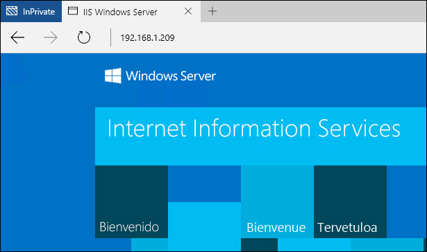

# Contenedores de Windows en Windows Server

**Esto es contenido preliminar y está sujeto a cambios.**

Este ejercicio le guiará a través de la implementación básica y el uso de la característica de contenedores de Windows en Windows Server. Una vez realizado, habrá instalado el rol de contenedor e implementado un contenedor sencillo de Windows Server. Antes de comenzar este inicio rápido, familiarícese con la terminología y los conceptos básicos de los contenedores. Esta información se encuentra en la [Introducción a los contenedores](./quick_start.md).

Este inicio rápido es específico de los contenedores de Windows Server en Windows Server 2016. En la tabla de contenido del lado izquierdo de esta página encontrará documentación adicional de inicio rápido.

**Requisitos previos:**

Un equipo (físico o virtual) con [Windows Server 2016 Technical Preview 5](https://www.microsoft.com/en-us/evalcenter/evaluate-windows-server-technical-preview).

Hay una imagen de Windows Server totalmente configurada disponible en Azure. Para usar esta imagen, implemente una máquina virtual haciendo clic en el botón siguiente. La implementación tardará unos 10 minutos. Una vez completada, inicie sesión en la máquina virtual de Azure y vaya al paso 4 de este tutorial. 

<a href="https://portal.azure.com/#create/Microsoft.Template/uri/https%3A%2F%2Fraw.githubusercontent.com%2FMicrosoft%2FVirtualization-Documentation%2Fmaster%2Fwindows-server-container-tools%2Fcontainers-azure-template%2Fazuredeploy.json" target="_blank">
    
</a>

## 1. Instalar la característica de contenedor

La característica de contenedor debe habilitarse antes de trabajar con contenedores de Windows. Para ello, ejecute el comando siguiente en una sesión de PowerShell con privilegios elevados.

```none
Install-WindowsFeature containers
```

Cuando la instalación de la característica haya finalizado, reinicie el equipo.

```none
Restart-Computer -Force
```

## 2. Instalar Docker

Para trabajar con contenedores de Windows es necesario Docker. Docker consta de motor y cliente. En este ejercicio se instalarán ambos.

Cree una carpeta para los ejecutables de Docker.

```none
New-Item -Type Directory -Path 'C:\Program Files\docker\'
```

Descargue el demonio de Docker.

```none
Invoke-WebRequest https://aka.ms/tp5/b/dockerd -OutFile $env:ProgramFiles\docker\dockerd.exe -UseBasicParsing
```

Descargue el cliente de Docker.

```none
Invoke-WebRequest https://aka.ms/tp5/b/docker -OutFile $env:ProgramFiles\docker\docker.exe -UseBasicParsing
```

Agregue el directorio de Docker a la ruta de acceso del sistema. Una vez hecho esto, reinicie la sesión de PowerShell para que reconozca la ruta de acceso modificada.

```none
[Environment]::SetEnvironmentVariable("Path", $env:Path + ";C:\Program Files\Docker", [EnvironmentVariableTarget]::Machine)
```

Para instalar Docker como un servicio de Windows, ejecute lo siguiente.

```none
dockerd --register-service
```

Una vez instalado, puede iniciar el servicio.

```none
Start-Service docker
```

## 3. Instalar imágenes base del contenedor

Los contenedores de Windows se implementan a partir de plantillas o imágenes. Para implementar un contenedor, es necesario descargar una imagen base del sistema operativo. Los comandos siguientes descargarán la imagen base de Windows Server Core.

En primer lugar, instale el proveedor de paquetes de imágenes del contenedor.

```none
Install-PackageProvider ContainerImage -Force
```

Después, instale la imagen de Windows Server Core. Como este proceso puede tardar algún tiempo, puede dedicarse a otros asuntos y retomarlo cuando se haya completado la descarga.

```none
Install-ContainerImage -Name WindowsServerCore    
```

Cuando se haya instalado la imagen base, debe reiniciar el servicio Docker.

```none
Restart-Service docker
```

En este punto, si se ejecuta `docker images`, se devolverá una lista de imágenes instaladas, en este caso la imagen de Windows Server Core.

```none
docker images

REPOSITORY          TAG                 IMAGE ID            CREATED             SIZE
windowsservercore   10.0.14300.1000     dbfee88ee9fd        7 weeks ago         9.344 GB
```

Antes de continuar, debe etiquetar la imagen con una versión "reciente". Para ello, ejecute el comando siguiente.

```none
docker tag windowsservercore:10.0.14300.1000 windowsservercore:latest
```

Para obtener información detallada sobre las imágenes de contenedor de Windows, consulte [Administración de imágenes del contenedor](../management/manage_images.md).

## 4. Implementar el primer contenedor

Para este ejercicio, se descarga una imagen de IIS creada previamente desde el Registro de Docker Hub y se implementa un contenedor sencillo con IIS.  

Para buscar imágenes de contenedores de Windows en Docker Hub, ejecute `docker search Microsoft`.  

```none
docker search microsoft

NAME                                         DESCRIPTION                                     
microsoft/sample-django:windowsservercore    Django installed in a Windows Server Core ...   
microsoft/dotnet35:windowsservercore         .NET 3.5 Runtime installed in a Windows Se...   
microsoft/sample-golang:windowsservercore    Go Programming Language installed in a Win...   
microsoft/sample-httpd:windowsservercore     Apache httpd installed in a Windows Server...   
microsoft/iis:windowsservercore              Internet Information Services (IIS) instal...   
microsoft/sample-mongodb:windowsservercore   MongoDB installed in a Windows Server Core...   
microsoft/sample-mysql:windowsservercore     MySQL installed in a Windows Server Core b...   
microsoft/sample-nginx:windowsservercore     Nginx installed in a Windows Server Core b...  
microsoft/sample-python:windowsservercore    Python installed in a Windows Server Core ...   
microsoft/sample-rails:windowsservercore     Ruby on Rails installed in a Windows Serve...  
microsoft/sample-redis:windowsservercore     Redis installed in a Windows Server Core b...   
microsoft/sample-ruby:windowsservercore      Ruby installed in a Windows Server Core ba...   
microsoft/sample-sqlite:windowsservercore    SQLite installed in a Windows Server Core ...  
```

Descargue la imagen de IIS mediante `docker pull`.  

```none
docker pull microsoft/iis:windowsservercore
```

La descarga de la imagen puede comprobarse con el comando `docker images`. Observe que aparecerá tanto la imagen base (windowsservercore) como la imagen de IIS.

```none
docker images

REPOSITORY          TAG                 IMAGE ID            CREATED             SIZE
microsoft/iis       windowsservercore   c26f4ceb81db        2 weeks ago         9.48 GB
windowsservercore   10.0.14300.1000     dbfee88ee9fd        8 weeks ago         9.344 GB
windowsservercore   latest              dbfee88ee9fd        8 weeks ago         9.344 GB
```

Usuario `docker run` para implementar el contenedor de IIS.

```none
docker run -d -p 80:80 microsoft/iis:windowsservercore ping -t localhost
```

Este comando ejecuta la imagen de IIS como un servicio en segundo plano (-d) y configura la red de forma que el puerto 80 del host de contenedor se asigne al puerto 80 del contenedor.
Para obtener información más detallada sobre el comando Run de Docker, consulte [Docker Run Reference (Referencia de Run de Docker)]( https://docs.docker.com/engine/reference/run/) en Docker.com.


Los contenedores en ejecución pueden verse con el comando `docker ps`. Tome nota del nombre del contenedor, ya que se usará en un paso posterior.

```none
docker ps

CONTAINER ID    IMAGE                             COMMAND               CREATED              STATUS   PORTS                NAMES
9cad3ea5b7bc    microsoft/iis:windowsservercore   "ping -t localhost"   About a minute ago   Up       0.0.0.0:80->80/tcp   grave_jang
```

Desde otro equipo, abra un explorador web y escriba la dirección IP del host de contenedor. Si todo se ha configurado correctamente, debería ver la pantalla de presentación de IIS. Se sirve desde la instancia de IIS hospedada en el contenedor de Windows.

**Nota**: Si está trabajando en Azure, necesitará la dirección IP externa de la máquina virtual y una seguridad de red configurada. Para más información, consulte [Cómo administrar grupos de seguridad de red con el Portal de Azure]( https://azure.microsoft.com/en-us/documentation/articles/virtual-networks-create-nsg-arm-pportal/#create-rules-in-an-existing-nsg).



De vuelta en el host de contenedor, use el comando `docker rm` para quitar el contenedor. Nota: Reemplace el nombre del contenedor de este ejemplo por el nombre real del contenedor.

```none
docker rm -f grave_jang
```
## Pasos siguientes

[Imágenes de contenedores en Windows Server](./quick_start_images.md)

[Contenedores de Windows en Windows 10](./quick_start_windows_10.md)


<!--HONumber=Jun16_HO5-->


